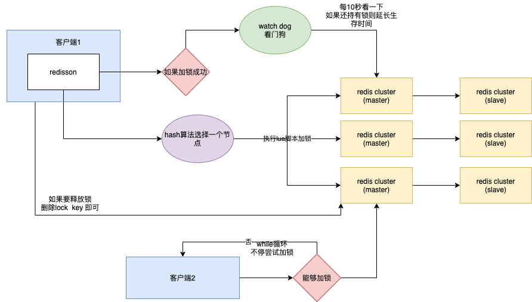

## 分布式锁
### Redis实现方案
#### 案例一
实现思路: 主要是使用了redis 的setnx命令,缓存了锁。
```
只在键 key 不存在的情况下， 将键 key 的值设置为 value 。
若键 key 已经存在， 则 SETNX 命令不做任何动作。
SETNX 是『SET if Not eXists』(如果不存在，则 SET)的简写
```
```java
//伪代码
public static boolean lock(String key,String lockValue,int expire){
    if(null == key)
        return false;
    Jedis jedis = null;
    try {
        jedis = jedisManager.getResource();
        String res = jedis.setNX(key,lockValue); 
        if(OK.equals(res))
            jedis.expire(expire);
            return true;
        else
            return false;
    } catch (Exception e) {
        return false;
    }final {
        if(jedis != null) 
            jedis.close();
    }
}

```
这种写法接口，先setnx()再使用expire()设置key的过期时间，可以满足大多数需求.但是还是有必要完善的地方  
问题一: 代码中首先是setnx，在expire还没成功时，系统崩溃导致key键没有过期时间一直存在。则其余需要lock的地方永远都没办法拿到锁  
问题二: 在Redis哨兵模式中，可能会有同步不及时问题发生，A进程在机器AM中setnx A->AValue，几乎同时B进程在机器BM中setnx B->BValue。一系列操作完成后AM 和BM 机器还没同步。此时两台机器拿到的值是不一样的  
问题三: 无法实现公平锁功能  
#### 案例二
使用Redis Lua脚本的功能
```
Lock:
if redis.call('setnx',KEYS[1],ARGV[1]) == 1 
    then return redis.call('expire',KEYS[1],ARGV[2])  
else return 0 
end
这种写法 可以保证 setnx和expire是一个原子操作，避免了赋值的先后宕机问题，但是对于分布式Redis系统还是没能很好解决不一致问题
对于公平锁的实现，可以考虑使用redis中的list写在Lua中
公平锁伪代码：
if redis.call('setnx',KEYS[1],ARGV[1]) == 1 
    then return redis.call('expire',KEYS[1],ARGV[2])  
else 
    reids.call('rpush', '某工程:某业务:KEYS[1]', ARGV[1])
    return 0 
end
解锁伪代码:
if redis.call('get',KEYS[1]) == ARGV[1] 
    first = reids.call('lpop', '某工程:某业务:KEYS[1]')
    if first not null
    then LOCK操作
else return 0 
end
```
#### 案例三
使用开源Redisson库<br>
```
RLock lock = redisson.getLock("myLock");
lock.lock();
lock.unlock();
```

### 整体流程
基于 Redis Cluster 的分布式锁的完整生命周期，从加锁到锁的持有与管理，再到最终的释放锁，通过这些机制保证了在分布式系统中对共享资源的互斥访问，确保数据的一致性和完整性，防止并发访问导致的数据错误或不一致问题。同时，利用 Redis 的特性（如原子性操作、集群架构等）和 watch dog 机制来提高锁的可靠性和灵活性，适应不同的业务场景需求。
1. 该流程图主要描述了在基于 Redis Cluster 的分布式环境中，客户端使用 Redisson 框架进行加锁、锁的持有与延长以及释放锁的过程。
2. 涉及到客户端、Redisson 框架、Redis Cluster（包括主节点 master 和从节点 slave）以及 watch dog（看门狗）等关键组件之间的交互。

### 加锁流程
1. **客户端发起加锁请求**：客户端 1 想要获取锁，通过 Redisson 框架向 Redis Cluster 中的某个节点（根据 hash 算法选择）发起加锁操作。
2. **Redisson 执行 lua 脚本加锁**：Redisson 框架在选定的节点（假设为 master 节点）上执行 lua 脚本进行加锁操作。这里使用 lua 脚本是为了保证加锁操作的原子性，确保在分布式环境下锁操作的正确性。

### 锁的持有与延长
1. **锁信息记录与初始生存时间设置**：如果加锁成功，Redis Cluster（master）节点会记录锁的相关信息
2. **Watch dog 监控与生存时间延长**：Watch dog 会每隔 10 秒检查一次客户端 1 是否仍然持有锁（通过查看锁的相关标识等信息）。如果客户端 1 仍然持有锁，Watch dog 会执行相应操作来延长锁的生存时间，以防止锁因超时而被错误释放，确保在业务逻辑执行过程中锁的有效性。

### 释放锁流程
1. **客户端发起释放锁请求**：当客户端 1 完成相关业务操作后，通过 Redisson 框架向 Redis Cluster（master）节点发起释放锁的请求，同样是执行 lua 脚本进行释放锁操作。
2. **Redis Cluster 处理释放锁**：Redis Cluster（master）节点接收到释放锁请求后，会根据锁的状态等信息判断是否可以释放锁。如果满足释放条件（例如锁的持有者确实是客户端 1 且锁未被其他线程或进程占用等），则删除 “myLock” 对应的 key，从而完成锁的释放操作，使其他客户端有机会获取该锁。