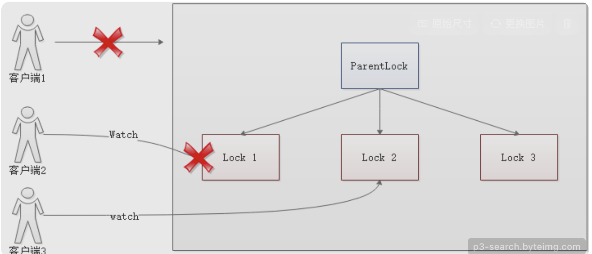
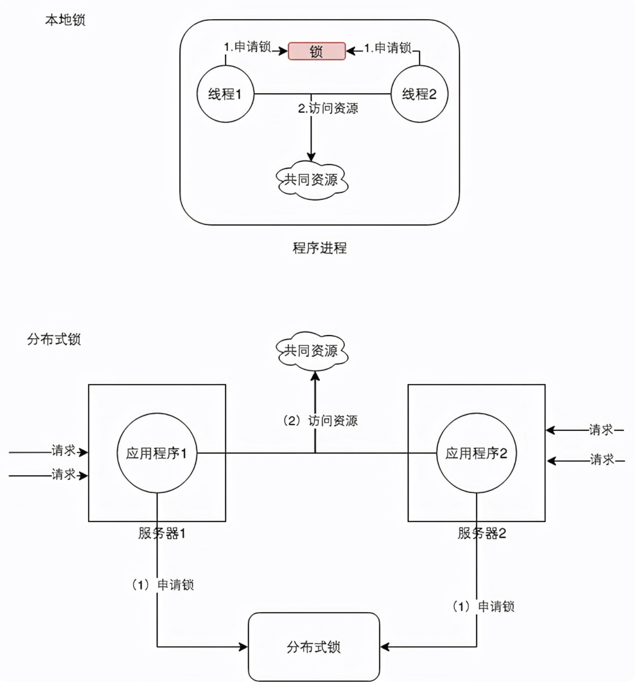

## 一、引言

Zookeeper 作为一个强大的分布式协调服务框架，在实现分布式锁方面有着独特的优势。本文将详细介绍 Zookeeper 实现分布式锁的原理、步骤以及优缺点，并通过图文结合的方式帮助读者更好地理解。

在分布式系统中，多个节点需要协调对共享资源的访问，以避免数据不一致和并发问题。分布式锁就是一种用于解决这个问题的机制，它确保在任何时候只有一个节点能够访问特定的资源。

Zookeeper 是一个开源的分布式协调服务，它提供了一种简单而有效的方式来实现分布式锁。Zookeeper 的节点结构和特性使其非常适合用于实现分布式锁。

### Zookeeper 的特性与分布式锁的需求

Zookeeper 具有以下特性，使其成为实现分布式锁的理想选择：

1. 顺序节点：Zookeeper 的每一个节点都是一个天然的顺序发号器。在每一个节点下面创建临时顺序节点（EPHEMERAL_SEQUENTIAL）类型，新的子节点后面会加上一个次序编号，这个编号是上一个生成的次序编号加一。

2. 节点监听机制：Zookeeper 的节点监听机制可以保障占有锁的传递有序而且高效。每个线程抢占锁之前，先尝试创建自己的 ZNode。同样，释放锁的时候，就需要删除创建的 Znode。创建成功后，如果不是排号最小的节点，就处于等待通知的状态。等谁的通知呢？不需要其他人，只需要等前一个 Znode 的通知就可以了。前一个 Znode 删除的时候，会触发 Znode 事件，当前节点能监听到删除事件，就是轮到了自己占有锁的时候。

3. 临时节点：如果某个客户端创建临时顺序节点之后，不小心自己宕机了也没关系，Zookeeper 感知到那个客户端宕机，会自动删除对应的临时顺序节点，相当于自动释放锁，或者是自动取消自己的排队。

这些特性满足了分布式锁的需求：

1. 互斥性：在任何时候，只有一个客户端能够获得锁。

2. 公平性：按照请求的顺序来分配锁，先到先得。

3. 可靠性：即使客户端崩溃，锁也能自动释放，不会造成死锁。

### Zookeeper 分布式锁的原理

Zookeeper 分布式锁的原理基于临时顺序节点和节点监听机制。以下是具体的原理：

1. 创建父节点：首先需要创建一个父节点，尽量是持久节点（PERSISTENT 类型）。这个父节点代表了锁的资源。

2. 创建临时顺序节点：每个要获得锁的线程，都在这个父节点下创建一个临时顺序节点。Zookeeper 会为这些节点分配一个顺序编号。

3. 判断是否获得锁：线程创建完节点后，会检查自己创建的节点是否是所有子节点中序号最小的。如果是，则获得锁；如果不是，则监听比自己序号小的那个节点。

4. 监听节点变化：当一个节点被删除时，它后面的节点会收到通知。如果这个节点是当前线程监听的节点，那么当前线程会再次检查自己是否是序号最小的节点。如果是，则获得锁；如果不是，则继续监听。

下面通过一个简单的故事来类比 Zookeeper 分布式锁的原理。

故事发生在一个没有自来水的古代，在一个村子有一口井，水质非常的好，村民们都抢着取井里的水。井就那么一口，村里的人很多，村民为争抢取水打架斗殴，甚至头破血流。

问题总是要解决，于是村长绞尽脑汁，最终想出了一个凭号取水的方案。井边安排一个看井人，维护取水的秩序。

取水秩序很简单：

（1）取水之前，先取号；

（2）号排在前面的，就可以先取水；

（3）先到的排在前面，那些后到的，一个一个挨着，在井边排成一队。

这种排队取水模型，就是一种锁的模型。排在最前面的号，拥有取水权，就是一种典型的独占锁。另外，先到先得，号排在前面的人先取到水，取水之后就轮到下一个号取水，挺公平的，说明它是一种公平锁。

假定，取水时以家庭为单位，家庭的某人拿到号，其他的家庭成员过来打水，这时候不用再取号。如果取水时以家庭为单位，则同一个家庭，可以直接复用排号，不用从后面排起重新取号。

以上这个故事模型中，取号一次，可以用来多次取水，其原理为可重入锁的模型。在重入锁模型中，一把独占锁，可以被多次锁定，这就叫做可重入锁。

理解了经典的公平可重入锁的原理后，再来看在分布式场景下的公平可重入锁的原理。

通过前面的分析，基本可以判定：ZooKeeper 的临时顺序节点，天生就有一副实现分布式锁的胚子。

为什么呢？

（一）ZooKeeper 的每一个节点，都是一个天然的顺序发号器。在每一个节点下面创建临时顺序节点（EPHEMERAL_SEQUENTIAL）类型，新的子节点后面，会加上一个次序编号，而这个生成的次序编号，是上一个生成的次序编号加一。

例如，有一个用于发号的节点 “/test/lock” 为父亲节点，可以在这个父节点下面创建相同前缀的临时顺序子节点，假定相同的前缀为 “/test/lock/seq-”。第一个创建的子节点基本上应该为 /test/lock/seq-0000000000，下一个节点则为 /test/lock/seq-0000000001，依次类推。

（二）ZooKeeper 节点的递增有序性，可以确保锁的公平。

一个 ZooKeeper 分布式锁，首先需要创建一个父节点，尽量是持久节点（PERSISTENT 类型），然后每个要获得锁的线程，都在这个节点下创建个临时顺序节点。由于 ZK 节点，是按照创建的次序，依次递增的。为了确保公平，可以简单的规定：编号最小的那个节点，表示获得了锁。所以，每个线程在尝试占用锁之前，首先判断自己是排号是不是当前最小，如果是，则获取锁。

（三）ZooKeeper 的节点监听机制，可以保障占有锁的传递有序而且高效。

每个线程抢占锁之前，先尝试创建自己的 ZNode。同样，释放锁的时候，就需要删除创建的 Znode。创建成功后，如果不是排号最小的节点，就处于等待通知的状态。等谁的通知呢？不需要其他人，只需要等前一个 Znode 的通知就可以了。前一个 Znode 删除的时候，会触发 Znode 事件，当前节点能监听到删除事件，就是轮到了自己占有锁的时候。第一个通知第二个、第二个通知第三个，击鼓传花似的依次向后。ZooKeeper 的节点监听机制，能够非常完美地实现这种击鼓传花似的信息传递。

具体的方法是，每一个等通知的 Znode 节点，只需要监听（linsten）或者监视（watch）排号在自己前面那个，而且紧挨在自己前面的那个节点，就能收到其删除事件了。

下面通过图片来进一步说明 Zookeeper 分布式锁的原理。

（插入图片：Zookeeper 分布式锁原理图，展示父节点、临时顺序节点、节点监听机制等）

### Zookeeper 分布式锁的步骤

实现 Zookeeper 分布式锁的步骤如下：

1. 创建父节点：使用 Zookeeper 的客户端连接到 Zookeeper 服务器，创建一个持久节点作为锁的父节点。

2. 创建临时顺序节点：每个客户端在父节点下创建一个临时顺序节点。

3. 判断是否获得锁：客户端检查自己创建的节点是否是所有子节点中序号最小的。如果是，则获得锁；如果不是，则监听比自己序号小的那个节点。

4. 监听节点变化：当一个节点被删除时，它后面的节点会收到通知。如果这个节点是当前客户端监听的节点，那么当前客户端会再次检查自己是否是序号最小的节点。如果是，则获得锁；如果不是，则继续监听。

5. 释放锁：当客户端完成对共享资源的访问后，删除自己创建的临时顺序节点，释放锁。

下面是一个使用 Java 语言实现 Zookeeper 分布式锁的示例代码：

```java
import org.apache.zookeeper.*;  
  
import java.util.concurrent.CountDownLatch;  
  
public class DistributedLockExample implements Watcher {  
  
    private ZooKeeper zookeeper;  
  
    private String lockPath = "/distributed-lock";  
  
    private CountDownLatch connectedSemaphore = new CountDownLatch(1);  
  
    public static void main(String[] args) throws Exception {  
  
        DistributedLockExample example = new DistributedLockExample();  
  
        example.initZooKeeper();  
  
        example.acquireLock();  
  
    }  
  
    public void initZooKeeper() throws IOException {  
  
        zookeeper = new ZooKeeper("localhost:2181", 3000, this);  
  
        connectedSemaphore.await();  
  
    }  
  
    @Override  
  
    public void process(WatchedEvent event) {  
  
        if (event.getState() == KeeperState.SyncConnected) {  
  
            connectedSemaphore.countDown();  
  
        }  
  
    }  
  
    public void acquireLock() throws KeeperException, InterruptedException {  
  
// 创建锁节点  
  
        try {  
  
            zookeeper.create(lockPath, new byte[0], ZooDefs.Ids.OPEN_ACL_UNSAFE, CreateMode.PERSISTENT);  
  
        } catch (KeeperException.NodeExistsException e) {  
  
// 忽略已存在的锁节点  
  
        }  
  
// 创建临时顺序节点  
  
        String lockNodePath = zookeeper.create(lockPath + "/lock-", new byte[0], ZooDefs.Ids.OPEN_ACL_UNSAFE, CreateMode.EPHEMERAL_SEQUENTIAL);  
  
// 获取当前节点的名称  
  
        String nodeName = lockNodePath.substring(lockPath.length() + 1);  
  
// 查找前驱节点  
  
        List<String> children = zookeeper.getChildren(lockPath, true);  
  
        String predecessor = null;  
  
        for (String child : children) {  
  
            if (child.compareTo(nodeName) < 0) {  
  
                predecessor = child;  
  
            }  
  
        }  
  
        if (predecessor == null) {  
  
// 没有前驱节点，当前客户端获得了锁  
  
            System.out.println("Lock acquired by client.");  
  
        } else {  
  
// 监听前驱节点的删除事件  
  
            String predecessorPath = lockPath + "/" + predecessor;  
  
            zookeeper.exists(predecessorPath, new Watcher() {  
  
                @Override  
  
                public void process(WatchedEvent event) {  
  
                    if (event.getType() == EventType.NodeDeleted) {  
  
// 前驱节点被删除，当前客户端获得了锁  
  
                        System.out.println("Lock acquired by client.");  
  
                    }  
  
                }  
  
            });  
  
        }  
  
    }  
  
    public void releaseLock() throws KeeperException, InterruptedException {  
  
// 获取当前客户端创建的节点名称  
  
        List<String> children = zookeeper.getChildren(lockPath, false);  
  
        String nodeName = children.stream().filter(child -> zookeeper.exists(lockPath + "/" + child, false).getEphemeralOwner() == zookeeper.getSessionId()).findFirst().orElse(null);  
  
        if (nodeName!= null) {  
  
// 删除节点以释放锁  
  
            zookeeper.delete(lockPath + "/" + nodeName, -1);  
  
            System.out.println("Lock released by client.");  
  
        } else {  
  
            System.out.println("No lock to release.");  
  
        }  
  
    }  
  
}

```

### Zookeeper 分布式锁的优缺点

Zookeeper 分布式锁具有以下优点：

1. 可靠性高：Zookeeper 是一个高可用的分布式协调服务，它能够保证在分布式环境下锁的可靠性。

2. 公平性：Zookeeper 分布式锁是一种公平锁，按照请求的顺序来分配锁，先到先得。

3. 易于实现：Zookeeper 提供了丰富的 API，使得实现分布式锁变得相对容易。

然而，Zookeeper 分布式锁也存在一些缺点：

1. 性能问题：由于每次在创建锁和释放锁的过程中，都要动态创建、销毁瞬时节点来实现锁功能。ZK 中创建和删除节点只能通过 Leader 服务器来执行，然后 Leader 服务器还需要将数据同步到所有的 Follower 机器上，这样频繁的网络通信，性能的短板是非常突出的。

2. 依赖 Zookeeper 集群：如果 Zookeeper 集群出现问题，那么分布式锁也将无法正常工作。

总之，在高性能，高并发的场景下，不建议使用 Zookeeper 的分布式锁。而由于 Zookeeper 的高可用特性，所以在并发量不是太高的场景，推荐使用 Zookeeper 的分布式锁。

## 二、Zookeeper 实现分布式锁的原理



利用 Zookeeper 的临时顺序节点和 Watcher 监听器机制，实现分布式锁。具体来说，每个要获得锁的线程在特定节点下创建临时顺序节点，通过比较节点序号来确定是否获得锁，同时利用 Watcher 机制监听前一个节点的变化，实现锁的传递。

Zookeeper 实现分布式锁的原理基于临时顺序节点和节点监听机制。首先需要创建一个父节点，尽量是持久节点（PERSISTENT 类型）。这个父节点代表了锁的资源。每个要获得锁的线程，都在这个父节点下创建一个临时顺序节点。Zookeeper 会为这些节点分配一个顺序编号。

线程创建完节点后，会检查自己创建的节点是否是所有子节点中序号最小的。如果是，则获得锁；如果不是，则监听比自己序号小的那个节点。当一个节点被删除时，它后面的节点会收到通知。如果这个节点是当前线程监听的节点，那么当前线程会再次检查自己是否是序号最小的节点。如果是，则获得锁；如果不是，则继续监听。

例如，多个客户端同时要争抢 Zookeeper 上的一把分布式锁。假设客户端 A 抢先一步，对 Zookeeper 发起加分布式锁的请求。客户端 A 会在锁节点下创建一个临时顺序节点，假设节点名称为 “/my_lock/lock-000001”。接着，客户端 A 会查询 “/my_lock” 这个锁节点下的所有子节点，并按照序号排序。然后，客户端 A 会判断自己创建的节点是否是排在第一个。如果是，那么客户端 A 就获得了锁。

假如客户端 B 过来想要加锁，它也会在 “/my_lock” 这个锁节点下创建一个临时顺序节点，名称可能为 “/my_lock/lock-000002”。客户端 B 同样会查询 “/my_lock” 锁节点下的所有子节点，按序号顺序排列。此时，客户端 B 会发现自己创建的节点不是第一个，所以加锁失败。加锁失败后，客户端 B 会对自己上一个顺序节点，也就是客户端 A 创建的节点加一个监听器，监听这个节点是否被删除等变化。

当客户端 A 释放锁时，会删除自己在 Zookeeper 里创建的那个顺序节点。删除了那个节点之后，Zookeeper 会负责通知监听这个节点的监听器，也就是客户端 B 之前加的那个监听器。此时，客户端 B 的监听器感知到了上一个顺序节点被删除，也就是排在他之前的某个客户端释放了锁。此时，客户端 B 会重新尝试去获取锁，也就是获取 “/my_lock” 节点下的子节点集合，然后判断自己是否是序号最小的节点。如果是，就可以加锁了。

这种实现方式具有很多优点。首先，可靠性高，Zookeeper 是一个高可用的分布式协调服务，能够保证在分布式环境下锁的可靠性。其次，公平性好，Zookeeper 分布式锁是一种公平锁，按照请求的顺序来分配锁，先到先得。而且，易于实现，Zookeeper 提供了丰富的 API，使得实现分布式锁变得相对容易。

然而，Zookeeper 分布式锁也存在一些缺点。一方面，性能问题比较突出，由于每次在创建锁和释放锁的过程中，都要动态创建、销毁瞬时节点来实现锁功能。ZK 中创建和删除节点只能通过 Leader 服务器来执行，然后 Leader 服务器还需要将数据同步到所有的 Follower 机器上，这样频繁的网络通信，性能的短板非常明显。另一方面，如果 Zookeeper 集群出现问题，那么分布式锁也将无法正常工作。

总之，在高性能、高并发的场景下，不建议使用 Zookeeper 的分布式锁。而由于 Zookeeper 的高可用特性，所以在并发量不是太高的场景，推荐使用 Zookeeper 的分布式锁。

## 三、Zookeeper 实现分布式锁的步骤



1. 创建 Zookeeper 客户端连接到 Zookeeper 集群。通过创建 ZooKeeper 对象，指定连接地址和超时时间，建立与 Zookeeper 服务器的连接。在实际应用中，可以使用以下代码创建 Zookeeper 客户端连接：

``` java
ZooKeeper zookeeper = new ZooKeeper("localhost:2181", 3000, null);
```

2. 在 Zookeeper 中创建一个持久性节点用于锁。使用 create 方法创建一个持久性节点，作为锁的基础节点。可以使用以下代码创建持久性节点：

``` java
zk.create("/locks", new byte[0], ZooDefs.Ids.OPEN_ACL_UNSAFE, CreateMode.PERSISTENT);
```

3. 获取锁：尝试在 Zookeeper 中创建一个临时顺序节点。当线程需要获取锁时，在锁节点下创建一个临时顺序节点。以下是创建临时顺序节点的代码示例：

``` java
String lockPath = zk.create("/locks/lock-", new byte[0], ZooDefs.Ids.OPEN_ACL_UNSAFE, CreateMode.EPHEMERAL_SEQUENTIAL);
```

4. 判断是否获取到锁：检查自己创建的节点是否是所有节点中最小的。获取锁节点下的所有子节点，比较自己创建的节点序号是否最小。如果是最小序号，则获得锁；否则，监听前一个节点的变化。首先获取所有子节点：

```java
List<String> children = zk.getChildren("/locks", false);
```

然后比较自己创建的节点是否最小：

```java
Collections.sort(children);

if (lockPath.equals("/locks/" + children.get(0))) {
	// 获取到锁
	// 执行关键代码
} else {
	// 未获取到锁
	// 监听前一个节点的变化
	String preNode = "";
	for (String child : children) {
		if (lockPath.endsWith(child)) {
			break;
		}
		preNode = child;
	}
	zk.getData("/locks/" + preNode, true, null);
}
```

5. 如果获取到锁，则执行关键代码，执行完毕后释放锁并删除自己创建的节点。获得锁后，执行需要互斥访问的关键代码。完成后，删除自己创建的临时顺序节点，释放锁。释放锁的代码如下：

```java
zk.delete(lockPath, -1);
```

6. 如果未获取到锁，则监听自己创建节点前一个节点的变化。未获得锁的线程，通过 getData 方法监听前一个节点的变化，等待锁的释放。监听前一个节点变化的代码在判断未获取到锁的逻辑中已经展示过：

```java
zk.getData("/locks/" + preNode, true, null);
```

7. 如果监听到前一个节点被删除，则重新去尝试获取锁。当监听到前一个节点被删除时，重新进行序号比较，判断自己是否获得锁。当监听到前一个节点被删除时，会触发监听事件，在事件处理方法中重新检查自己是否是序号最小的节点，如果是，则获得锁；如果不是，则继续监听。以下是事件处理方法的示例代码：

```java
zk.exists(predecessorPath, new Watcher() {
	@Override
	public void process(WatchedEvent event) {
	if (event.getType() == EventType.NodeDeleted) {
	
		// 前驱节点被删除，当前客户端获得了锁
	
		System.out.println("Lock acquired by client.");
	
		}
	}
});
```

8. 循环执行步骤 3 和步骤 4，直到获取到锁为止。不断重复尝试获取锁的过程，直到成功获得锁。在步骤 3 和步骤 4 的逻辑中进行循环操作，直到获取到锁为止。可以使用一个循环来实现：

``` java
while (true) {    
	// 尝试获取锁的逻辑    
	// 判断是否获取到锁的逻辑
}
```

## 四、Zookeeper 分布式锁的优缺点
### 1. 优点

- **安全可靠，能有效解决分布式问题，保证数据的一致性**：Zookeeper 作为一个高可用的分布式协调服务，其数据一致性机制确保了在分布式环境下锁的可靠性。通过 Zab 协议（ZooKeeper Atomic Broadcast，ZooKeeper 原子广播协议），Zookeeper 实现了主备模式的系统架构，保证了集群中各个副本之间数据的一致性。例如，在数据写入过程中，只有当数据被半数以上的 Zookeeper 节点持久化后，Leader 节点才会把该次事务在内存中生效，从而保证了数据的一致性。

- **可实现公平锁，先请求锁的线程先获得锁**：Zookeeper 的临时顺序节点特性使得实现公平锁成为可能。在 Zookeeper 分布式锁的实现中，每个要获得锁的线程在特定节点下创建临时顺序节点，通过比较节点序号来确定是否获得锁，同时利用 Watcher 机制监听前一个节点的变化，实现锁的传递。这种按照创建顺序排队的实现方式，确保了先请求锁的线程先获得锁，避免了不公平竞争。

### 2. 缺点

- **性能不太高，每次创建和删除节点都需要与 Zookeeper 服务器进行通信，频繁的网络通信会影响性能**：Zookeeper 实现分布式锁的过程中，每次在创建锁和释放锁时，都要动态创建、销毁瞬时节点来实现锁功能。而 ZK 中创建和删除节点只能通过 Leader 服务器来执行，然后 Leader 服务器还需要将数据同步到所有的 Follower 机器上，这样频繁的网络通信，性能的短板是非常突出的。例如，在高并发的场景下，大量的线程同时竞争锁，频繁的创建和删除临时顺序节点会导致网络通信开销增大，从而影响系统的整体性能。此外，如果在集群规模大的时候，客户端无端的接受到过多的和自己不相关的事件通知，也会对 Server 造成很大的性能影响。而且如果一旦同一时间有多个节点的客户端断开连接，服务器就会像其余客户端发送大量的事件通知，这就是所谓的惊群效应。

## 五、总结
Zookeeper 实现分布式锁是一种可靠的解决方案，尤其适用于高可靠而并发量不是太大的场景。通过理解其原理和步骤，我们可以更好地在分布式系统中应用 Zookeeper 分布式锁，确保系统的稳定性和数据的一致性。同时，我们也需要根据实际场景，权衡其优缺点，选择最适合的分布式锁实现方案。

**一、总结 Zookeeper 分布式锁的优势**

1. **可靠性高**：Zookeeper 是一个高可用的分布式协调服务，其数据一致性机制确保了在分布式环境下锁的可靠性。通过 Zab 协议，Zookeeper 实现了主备模式的系统架构，保证了集群中各个副本之间数据的一致性。

2. **公平性好**：Zookeeper 的临时顺序节点特性使得实现公平锁成为可能。在 Zookeeper 分布式锁的实现中，每个要获得锁的线程在特定节点下创建临时顺序节点，通过比较节点序号来确定是否获得锁，同时利用 Watcher 机制监听前一个节点的变化，实现锁的传递。这种按照创建顺序排队的实现方式，确保了先请求锁的线程先获得锁，避免了不公平竞争。

3. **易于实现**：Zookeeper 提供了丰富的 API，使得实现分布式锁变得相对容易。例如，使用 Java 语言实现 Zookeeper 分布式锁时，可以通过创建 Zookeeper 客户端连接到 Zookeeper 服务器，在特定节点下创建临时顺序节点，并利用节点监听机制来实现锁的获取和释放。

**二、分析 Zookeeper 分布式锁的不足**

1. **性能问题**：由于每次在创建锁和释放锁的过程中，都要动态创建、销毁瞬时节点来实现锁功能。ZK 中创建和删除节点只能通过 Leader 服务器来执行，然后 Leader 服务器还需要将数据同步到所有的 Follower 机器上，这样频繁的网络通信，性能的短板是非常突出的。例如，在高并发的场景下，大量的线程同时竞争锁，频繁的创建和删除临时顺序节点会导致网络通信开销增大，从而影响系统的整体性能。此外，如果在集群规模大的时候，客户端无端的接受到过多的和自己不相关的事件通知，也会对 Server 造成很大的性能影响。而且如果一旦同一时间有多个节点的客户端断开连接，服务器就会像其余客户端发送大量的事件通知，这就是所谓的惊群效应。

2. **依赖 Zookeeper 集群**：如果 Zookeeper 集群出现问题，那么分布式锁也将无法正常工作。

**三、根据场景选择合适的分布式锁方案**

总之，在高性能，高并发的场景下，不建议使用 Zookeeper 的分布式锁。而由于 Zookeeper 的高可用特性，所以在并发量不是太高的场景，推荐使用 Zookeeper 的分布式锁。在目前分布式锁实现方案中，比较成熟、主流的方案有两种：基于 Redis 的分布式锁和基于 Zookeeper 的分布式锁。两种锁分别适用的场景为：

1. 基于 Zookeeper 的分布式锁，适用于高可靠（高可用）而并发量不是太大的场景，没有羊群效应。

2. 基于 Redis 的分布式锁，适用于并发量很大、性能要求很高的、而可靠性问题可以通过其他方案去弥补的场景。这里没有谁好谁坏的问题，而是谁更合适的问题。在实际应用中，需要根据具体的场景需求，权衡 Zookeeper 分布式锁的优缺点，选择最适合的分布式锁实现方案