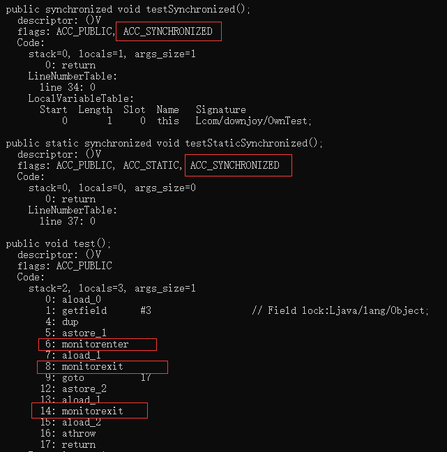
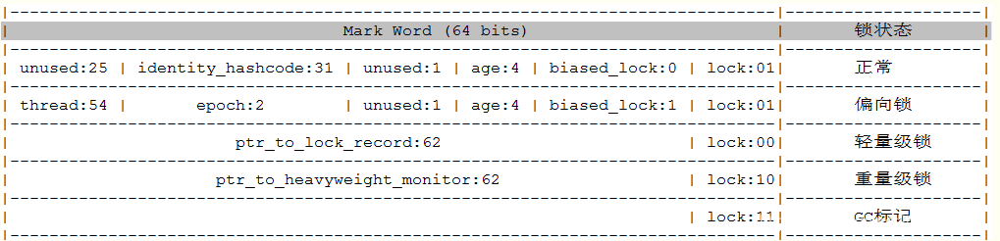

# synchronized提问
### synchronized 用法
```java
//获得的锁是 当前对象
public synchronized void testSynchronized(){}

//获得的锁是 当前对象的Class对象
public synchronized static void testStaticSynchronized(){}

public final Object lock = new Object();
public void test(){
    //获得的锁是 lock对象
    synchronized (lock){}
}
```
synchronized定义在方法体上生成的字节码会多 **ACC_SYNCHRONIZED**
定义在代码块上字节码会生成 **monitorenter**,和两个**monitorexit**，其中第二个monitorexit是防止程序异常可以看到多了**athrow**字节码 
通过javap -v 命令查看字节码<br/>


### 不得不说的Java对象分析(64位机器)
首先一个Java对象大小由三部分组成：对象头，对象体(一般认为对象中的属性大小)，对齐字节。<br/>
对象头包括MarkWord（8字节）、Klass Pointer(指向Class对象的指针)
对象如果是数组，对象头额外还会包含4字节的数组长度
下面通过代码演示。代码分析工具使用jol<br/>
**1.对象中不添加任何属性**
```java
public class T{ }
public static void main(String[] args) {
    T t = new T();
    ClassLayout classLayout = ClassLayout.parseInstance(t); //'org.openjdk.jol', name: 'jol-core', version: '0.9'
    System.out.println(classLayout.toPrintable());
}
```
```
打印结果
com.mouxf.jol.JolTestObjectDetail$T object internals:
 OFFSET  SIZE   TYPE DESCRIPTION                               VALUE
      0     4        (object header)                           01 00 00 00 (00000001 00000000 00000000 00000000) (1)
      4     4        (object header)                           00 00 00 00 (00000000 00000000 00000000 00000000) (0)
      8     4        (object header)                           43 c1 00 f8 (01000011 11000001 00000000 11111000) (-134168253)
     12     4        (loss due to the next object alignment)  
Instance size: 16 bytes
Space losses: 0 bytes internal + 4 bytes external = 4 bytes total

可以看到，整个T对象占用16bytes大小，其中对象头（object header）占用12字节
loss due to the next object alignment: 对齐补充，虚拟机要求对象所占用的内存大小必须是8的整数，当不足的时候，对齐补充
```

**2.对象中添加一个属性**
```java
public static class T{ 
    long testLong;
}
```
```
T类型里面添加一个long属性后，展示效果
com.mouxf.jol.JolTestObjectDetail$T object internals:
 OFFSET  SIZE   TYPE DESCRIPTION                               VALUE
      0     4        (object header)                           01 00 00 00 (00000001 00000000 00000000 00000000) (1)
      4     4        (object header)                           00 00 00 00 (00000000 00000000 00000000 00000000) (0)
      8     4        (object header)                           43 c1 00 f8 (01000011 11000001 00000000 11111000) (-134168253)
     12     4        (alignment/padding gap)                  
     16     8   long T.testLong                                0
Instance size: 24 bytes
Space losses: 4 bytes internal + 0 bytes external = 4 bytes total
可以看到，原本object header占用12字节，long占用8字节。需要对齐补充到8的倍数，所以占用24字节的空间
可以试试int, byte, short 类型自测，也可以证明int占用4字节，short 2字节 ,byte 1字节
```

**3.添加-XX:-UseCompressedOops参数**<br/>
UseCompressedOops参数用于指针压缩，64位机器上指针占用的大小应该是8字节，但是由于上两次实验得到Klass Pointer 占用4字节。JVM默认开启此参数
```
com.mouxf.jol.JolTestObjectDetail$T object internals:
 OFFSET  SIZE   TYPE DESCRIPTION                               VALUE
      0     4        (object header)                           01 00 00 00 (00000001 00000000 00000000 00000000) (1)
      4     4        (object header)                           00 00 00 00 (00000000 00000000 00000000 00000000) (0)
      8     4        (object header)                           10 35 92 1c (00010000 00110101 10010010 00011100) (479343888)
     12     4        (object header)                           00 00 00 00 (00000000 00000000 00000000 00000000) (0)
     16     1   byte T.testLong                                0
     17     7        (loss due to the next object alignment)
Instance size: 24 bytes
Space losses: 0 bytes internal + 7 bytes external = 7 bytes total
```
**4.对象数组**
```java
int[] t = new int[1];
ClassLayout classLayout = ClassLayout.parseInstance(t); //'org.openjdk.jol', name: 'jol-core', version: '0.9'
System.out.println(classLayout.toPrintable());
```
```
[I object internals:
 OFFSET  SIZE   TYPE DESCRIPTION                               VALUE
      0     4        (object header)                           01 00 00 00 (00000001 00000000 00000000 00000000) (1)
      4     4        (object header)                           00 00 00 00 (00000000 00000000 00000000 00000000) (0)
      8     4        (object header)                           68 0b 98 1b (01101000 00001011 10011000 00011011) (462949224)
     12     4        (object header)                           00 00 00 00 (00000000 00000000 00000000 00000000) (0)
     16     4        (object header)                           01 00 00 00 (00000001 00000000 00000000 00000000) (1)
     20     4        (alignment/padding gap)                  
     24     4    int [I.<elements>                             N/A
     28     4        (loss due to the next object alignment)
Instance size: 32 bytes
Space losses: 4 bytes internal + 4 bytes external = 8 bytes total
对象头里多了4字节，表示数组的长度。这也是为什么获取数组长度复杂度是O(1)的原因
```
理解了对象的组成结构，接下来着重说明对象头中的MarkWord。
在JVM中需要大量存储对象，存储时为了实现一些额外的功能，需要在对象中添加一些标记字段用于增强对象功能，这些标记字段组成了对象头<br>

<br/>着重查看最后3bit的内容,锁的变换对应了对象头的不同标志<br>
```
首先说明下jol生成的二进制格式，MarkWord如何阅读
      0     4        (object header)                           05 e8 06 01 (00000101 11101000 00000110 00000001) (17229829)
      4     4        (object header)                           01 00 00 00 (00000001 00000000 00000000 00000000) (0)
读取方式应该是    00000000 00000000 00000000 00000001 00000001 00000110 11101000 00000101   从尾往前读
```
**演示代码**
**1.偏向锁**
```java
Thread.sleep(5000); //等待jvm开启偏向锁
T t = new T();
System.out.println(ClassLayout.parseInstance(t).toPrintable());
synchronized (t){
    System.out.println(ClassLayout.parseInstance(t).toPrintable());
}
```
```
com.mouxf.jol.JolTestObjectDetail$T object internals:
 OFFSET  SIZE   TYPE DESCRIPTION                               VALUE
      0     4        (object header)                           05 00 00 00 (00000101 00000000 00000000 00000000) (5)
      4     4        (object header)                           00 00 00 00 (00000000 00000000 00000000 00000000) (0)
      8     4        (object header)                           43 c1 00 f8 (01000011 11000001 00000000 11111000) (-134168253)
     12     4        (loss due to the next object alignment)
Instance size: 16 bytes
Space losses: 0 bytes internal + 4 bytes external = 4 bytes total

com.mouxf.jol.JolTestObjectDetail$T object internals:
 OFFSET  SIZE   TYPE DESCRIPTION                               VALUE
      0     4        (object header)                           05 e8 06 01 (00000101 11101000 00000110 00000001) (17229829)
      4     4        (object header)                           00 00 00 00 (00000000 00000000 00000000 00000000) (0)
      8     4        (object header)                           43 c1 00 f8 (01000011 11000001 00000000 11111000) (-134168253)
     12     4        (loss due to the next object alignment)
Instance size: 16 bytes
Space losses: 0 bytes internal + 4 bytes external = 4 bytes total

可以看到最后三位是 101 代表着偏向锁，至于为什么两次打印都是101而不是一次 001和101？why？
```
**2.轻量级锁**
```java
public static void test3() throws Exception{
    Thread.sleep(5000);
    T t = new T();
    print(t);
    for (int i = 0; i < 1; i++) {
        Thread thread = new Thread(() -> {print(t);});
        thread.start();
        thread.join();
    }
}
public static void print(T t) {
    synchronized (t){
        System.out.println(Thread.currentThread().getName());
        System.out.println(ClassLayout.parseInstance(t).toPrintable());
    }
}
```
```
main
com.mouxf.jol.JolTestObjectDetail$T object internals:
 OFFSET  SIZE   TYPE DESCRIPTION                               VALUE
      0     4        (object header)                           05 e8 ff 02 (00000101 11101000 11111111 00000010) (50325509)
      4     4        (object header)                           00 00 00 00 (00000000 00000000 00000000 00000000) (0)
      8     4        (object header)                           43 c1 00 f8 (01000011 11000001 00000000 11111000) (-134168253)
     12     4        (loss due to the next object alignment)
Instance size: 16 bytes
Space losses: 0 bytes internal + 4 bytes external = 4 bytes total

Thread-0
com.mouxf.jol.JolTestObjectDetail$T object internals:
 OFFSET  SIZE   TYPE DESCRIPTION                               VALUE
      0     4        (object header)                           d8 f1 1c 1f (11011000 11110001 00011100 00011111) (521990616)
      4     4        (object header)                           00 00 00 00 (00000000 00000000 00000000 00000000) (0)
      8     4        (object header)                           43 c1 00 f8 (01000011 11000001 00000000 11111000) (-134168253)
     12     4        (loss due to the next object alignment)
Instance size: 16 bytes
Space losses: 0 bytes internal + 4 bytes external = 4 bytes total
可以发现t中最后3位由 101 -> 000 转变为轻量级锁
```
3.重量级锁
```java
public static void test4() throws Exception{
    T t = new T();
    print(t);
    for (int i = 0; i < 10; i++) {
        Thread thread = new Thread(() -> {print(t);});
        thread.start();
    }
}
```
```
由于打印内容较多，只拿出一部分
com.mouxf.jol.JolTestObjectDetail$T object internals:
 OFFSET  SIZE   TYPE DESCRIPTION                               VALUE
      0     4        (object header)                           fa c8 46 03 (11111010 11001000 01000110 00000011) (54970618)
      4     4        (object header)                           00 00 00 00 (00000000 00000000 00000000 00000000) (0)
      8     4        (object header)                           43 c1 00 f8 (01000011 11000001 00000000 11111000) (-134168253)
     12     4        (loss due to the next object alignment)
Instance size: 16 bytes
Space losses: 0 bytes internal + 4 bytes external = 4 bytes total
```
以上就是演示synchronized的锁升级过程，其实可以看出synchronized锁升级过程是 无锁->偏向锁->轻量级锁->重量级锁
### synchronized锁升级过程
- **偏向锁**
    1. 检查对象头标志 **01** 与 是否偏向 **0** （对象头最后 3bit）
    2. CAS修改MarkWord获取偏向锁，修改成功后将markword中线程ID指向当前线程A
    3. 当另一个线程B获取对象锁的时候，程序达到安全点后，查看对象头中线程情况。线程A不存活或者线程A不再使用该对象，线程竞争设置偏向锁
    4. 如果线程A继续持有对象锁，暂停当前线程，撤销偏向锁，升级为轻量级锁
- **轻量级锁**
    1. 当前线程开辟一块记录空间(Lock Recored)，同时复制Markword
    2. CAS修改MarkWord，修改成功升级为轻量级锁 **00**
    3. 线程B CAS修改失败自旋，达到自旋次数后还未获得锁则升级为重量级锁

**盗个图，总结得很好(侵删)**


### 锁的实现原理
每个对象都存在着一个**monitor**与之关联，当一个**monitor**被某个线程持有后，它便处于锁定状态。<br>
monitor是由**ObjectMonitor**实现的，位于HotSpot虚拟机源码ObjectMonitor.hpp文件，C++实现的。Java 程序调用wait(),notfiy(),notfiyAll()方法底层实现也是ObjectMonitor
```
ObjectMonitor() {
    _header       = NULL;
    _count        = 0; //线程获取锁的次数
    _waiters      = 0,
    _recursions   = 0; //锁的重入次数
    _object       = NULL;
    _owner        = NULL;  //_owner指向持有ObjectMonitor对象的线程
    _WaitSet      = NULL; //处于wait状态的线程，会被加入到_WaitSet
    _WaitSetLock  = 0 ;  //保护等待队列
    _Responsible  = NULL ;
    _succ         = NULL ;
    _cxq          = NULL ; //阻塞在entry上最近可达的线程列表
    FreeNext      = NULL ;
    _EntryList    = NULL ; //处于等待锁block状态的线程，会被加入到该列表
    _SpinFreq     = 0 ;
    _SpinClock    = 0 ;
    OwnerIsThread = 0 ;
  }
```
**获取锁**
1. 线程获取资源对象的锁，判断 _owner是否为空
2. 如果 _owner为null ，直接把其赋值，指向自己， _owner = self ,同时把重入次数 _recursions = 1， 获取锁成功
3. 如果 _self == cur 和当前线程一致，说明是重入， _recursions++ 
4. 线程进入_EntryList
### 相关参数
-XX:BiasedLockingStartupDelay=0 偏向锁在Java6 Java7默认是开启的，但是它在程序启动几秒之后在激活，关闭延迟
-XX:-UseBiasedLocking=false 关闭偏向锁

