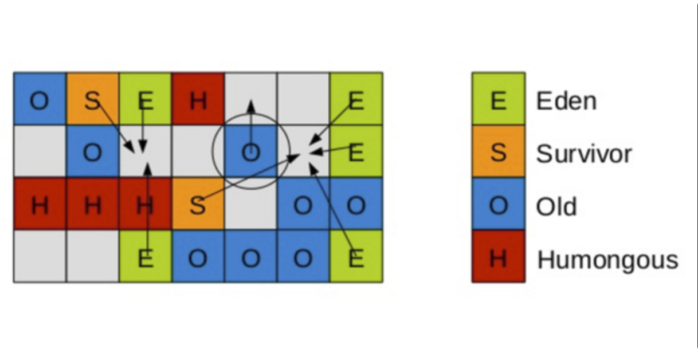

## 一、引言
Java 的垃圾收集器是自动内存管理的核心组件，负责回收不再使用的对象占用的内存，确保程序的稳定运行和高效性能。本文将深入探讨 Java 中各种垃圾收集器的原理、优缺点以及适用场景。

Java 中的垃圾收集器主要分为新生代收集器和老年代收集器，部分收集器可同时用于新生代和老年代。不同的垃圾收集器在性能、适用场景等方面存在差异。

### （一）Serial 收集器

1. **原理**：Serial 收集器是一个新生代收集器，单线程执行，使用复制算法。它在进行垃圾收集时，必须暂停其他所有的工作线程 (用户线程)。对于限定单个 CPU 的环境来说，由于没有线程交互的开销，可以获得最高的单线程收集效率。

2. **优点**：简单而高效，适用于单线程环境，对于小型应用和客户端应用有较好的性能。

3. **缺点**：只能使用单个线程进行垃圾收集，不能充分利用多核处理器的优势。

### （二）ParNew 收集器

1. **原理**：ParNew 收集器是 Serial 收集器的多线程版本，除了使用多线程进行垃圾收集之外，其余行为包括 Serial 收集器可用的所有控制参数、收集算法、Stop The World、对象分配规则、回收策略等都与 Serial 收集器完全一样。

2. **优点**：使用多个线程进行垃圾收集，能够更充分地利用多核处理器，加快垃圾收集速度。

3. **缺点**：在垃圾收集期间，应用程序的暂停时间会变长，不适合对响应时间敏感的应用。

### （三）Parallel Scavenge 收集器

1. **原理**：Parallel Scavenge 收集器也是一个新生代收集器，使用复制算法，并行多线程收集器。它的关注点与其他收集器不同，CMS 等收集器的关注点是尽可能地缩短垃圾收集时用户线程的停顿时间，而 Parallel Scavenge 收集器的目标则是达到一个可控制的吞吐量。

2. **优点**：高吞吐量可以最高效率地利用 CPU 时间，尽快完成程序的运算任务，主要适用于在后台不需要太多交互的任务。支持自适应的 GC 调节策略，无需手动指定一些细节参数，虚拟机会根据当前系统运行情况收集性能监控信息，动态调整这些参数以达到最大吞吐量。

3. **缺点**：在处理大量短命对象时性能可能较差。

### （四）Serial Old 收集器

1. **原理**：Serial Old 是 Serial 收集器的老年代版本，它同样使用一个单线程执行收集，使用 “标记 - 整理” 算法。

2. **优点**：在单核 CPU 环境下能充分发挥性能。主要用途是作为年老代中使用 CMS 收集器的后备垃圾收集方案，当 CMS 收集器产生 Concurrent Mode Failure 时，将临时启动 Serial Old 收集器重新进行老年代的垃圾收集。

3. **缺点**：会使应用程序停顿较长时间。

### （五）Parallel Old 收集器

1. **原理**：Parallel Old 是 Parallel Scavenge 收集器的老年代版本，使用多线程和 “标记 - 整理” 算法。

2. **优点**：在注重吞吐量的前提下，能充分利用多核 CPU 的优势，与 Parallel Scavenge 收集器搭配使用，可保证整体的吞吐量。

3. **缺点**：在一些对响应时间要求较高的场景下表现不佳。

### （六）CMS 收集器

1. **原理**：CMS（Concurrent Mark Sweep）收集器应用于老年代，实现真正意义上的并发垃圾收集器，是一种以获取最短回收停顿时间为目标的收集器。整个收集过程大致分为初始标记、并发标记、重新标记和并发清除四个步骤。在初始标记阶段，需要停顿所有用户线程，仅标记出 GC ROOTS 能直接关联到的对象，速度很快；并发标记阶段，进行 GC ROOTS 根搜索算法阶段，会判定对象是否存活，和用户线程一起工作，不需要暂停工作线程；重新标记阶段，为了修正并发标记期间，因用户程序继续运行而导致标记产生变动的那一部分对象的标记记录，需要停顿所有用户线程，停顿时间会被初始标记阶段稍长，但比并发标记阶段要短；并发清除阶段，清除 GC Roots 不可达对象，和用户线程一起工作，不需要暂停工作线程。

2. **优点**：并发收集、低停顿，适合对响应时间要求较高的应用。

3. **缺点**：对 CPU 资源非常敏感，在并发阶段，虽然不会导致用户线程停顿，但是会占用 CPU 资源而导致引用程序变慢，总吞吐量下降；无法处理浮动垃圾，可能出现 “Concurrent Mode Failure“，失败后而导致另一次 Full GC 的产生；会产生较多的碎片，可能导致内存空间的不连续，影响分配大对象的性能。

### （七）G1 收集器

1. **原理**：G1（Garbage-First）垃圾收集器，是在 JDK1.7 之后才出的一款商用的垃圾回收器。它将堆划分为多个区域，每次收集部分区域来减少 GC 产生的停顿时间。收集步骤包括新生代 GC 和并发标记周期等。在新生代 GC 阶段，主要工作是回收 Eden 和 survivor 区，存活的对象且没有达到年龄进入 To Survivor 区，对于一些达到年龄的对象进入老年代；并发标记周期回收比例较高的区域。

2. **优点**：并发与并行，能充分利用 CPU、多核环境下的硬件优势，使用多个 CPU 核心来缩短 Stop The World 的停顿时间；分代收集，收集范围包括新生代和老年代；可以精准控制停顿时间，不牺牲吞吐量前提下，实现低停顿垃圾回收，并具有大堆的应用程序提供解决方案；基于标记整理算法，没有内存碎片；堆内存划分为多个区域并排优先级，对垃圾多的区域优先回收，确保 G1 收集器可以在有限时间获得最高的垃圾收集效率。

3. **缺点**：与 CMS 相比，吞吐量略低。

## 二、Java 垃圾收集器的原理
### 1. 可达性分析算法

Java 的垃圾回收器主要采用可达性分析法来监视不再使用的对象。该方法基于一组称为 “GC Roots” 的根对象作为起始点，通过遍历对象图，找到所有与根对象可达的对象，并将其视为存活对象。而未被标记的对象则被视为垃圾，可以被回收。

根对象包括静态变量、JNI（Java Native Interface）引用、活动线程和 Java 虚拟机本身。例如，当一个对象可以从静态变量、正在执行的方法的局部变量表或者正在运行的线程中被访问到时，就认为这个对象是可达的。

可达性分析算法是 Java 垃圾收集器判断对象是否可回收的重要依据。它有效地解决了循环引用的问题，即使对象之间存在相互引用，但如果从 GC Roots 出发无法到达这些对象，它们也会被判定为可回收对象。

### 2. 标记 - 清除算法

标记 - 清除算法分为两个阶段：标记阶段和清除阶段。

在标记阶段，垃圾回收器从根对象开始遍历程序的对象图，将所有可达的对象进行标记。这个过程类似于在一个庞大的地图中，从一些特定的起点出发，寻找所有可以到达的地点并进行标记。根对象就像是地图中的起点，通过各种引用关系，垃圾回收器可以追踪到所有可达的对象。

在清除阶段，对堆内存进行遍历，将未标记的对象视为垃圾，并将其回收，释放内存空间。这就像是在地图中，把没有被标记的地点清理掉，回收其所占用的资源。

然而，标记 - 清除算法也存在一些缺点。一方面，标记和清除两个过程的效率都不高。在标记阶段，需要遍历整个对象图，这是一个耗时的操作。在清除阶段，需要逐个检查对象是否被标记，然后进行回收，也比较耗费时间。另一方面，标记清除之后会产生大量不连续的内存碎片，空间碎片太多可能会导致以后在程序运行过程中需要分配较大对象时，无法找到足够的连续内存而不得不提前触发另一次垃圾收集动作。

### 3. 压缩算法

在标记阶段完成后，压缩算法会将存活的对象向堆的一端移动，然后清理掉边界之外的内存。

这种算法的好处是可以提供更大的连续内存空间，减少碎片化问题，提高内存分配的效率。想象一下，就像整理杂乱的房间一样，把有用的物品集中到一起，清理出大片的连续空间，这样在后续需要放置新的大型物品时就更加方便。

例如，在某些需要频繁分配大对象的应用场景中，压缩算法可以有效地减少因内存碎片导致的分配失败情况，提高程序的稳定性和性能。

### 4. 分代回收策略

Java 的垃圾回收器通常采用分代回收的策略。它将堆内存划分为不同的代，如新生代（Young Generation）和老年代（Old Generation）。

新生代主要存放新创建的对象。新对象通常生命周期较短，很多在短时间内就会变成垃圾。这就像一个幼儿园，孩子们（新对象）在这里快速成长和变化，有些很快就离开了（变成垃圾被回收）。在新生代中，垃圾回收器通常采用复制算法，因为大部分对象都是 “朝生夕灭” 的，复制存活对象的成本相对较低。同时，新生代又可以进一步细分为 Eden 区、Survivor0（简称 S0）、Survivor1（简称 S1）。绝大多数刚刚被创建的对象会存放在 Eden 区。

当 Eden 区满的时候，JVM 会触发 Minor GC。首先将 Eden 区的垃圾对象回收清除，并将存活的对象复制到 S0，此时 S1 是空的。下一次 Eden 区满时，再执行一次垃圾回收。此次会将 Eden 和 S0 区中所有垃圾对象清除，并将存活对象复制到 S1，此时 S0 变为空。再下一次 Eden 区满时，再执行一次垃圾回收。此次会将 Eden 和 S1 区中所有垃圾对象清除，并将存活对象复制到 S0，此时 S1 变为空。如此反复在 S0 和 S1 之间切换几次（默认 15 次）之后，如果还有存活对象，说明这些对象的生命周期较长，则将它们转移到老年代中。

老年代主要存放存活时间较长的对象。这些对象就像成年人，相对比较稳定，不容易被回收。老年代的垃圾回收频率较低，一般采用标记 - 整理算法或标记 - 清除算法。当老年代也满了装不下的时候，就会触发 Major GC，Major GC 的耗时比较长，因为要先整体扫描再回收，而且会产生内存碎片。为了减少内存损耗，一般需要合并或者标记出来方便下次直接分配。

分代回收策略的优点在于可以根据不同代的特点采用不同的垃圾回收算法，提高垃圾回收的效率。例如，在新生代中，由于对象生命周期短，复制算法可以快速回收垃圾；而在老年代中，由于对象存活率高，标记 - 整理或标记 - 清除算法更加适合。同时，分代回收策略也可以减少 Full GC 的次数，提高程序的性能。

## 三、常见 Java 垃圾收集器的优缺点

### 1. Serial 收集器

1. 优点：简单而高效，适用于单线程环境，对于小型应用和客户端应用有较好的性能；对于内存资源受限的环境，它是所有收集器里额外内存消耗最小的；在单核处理器或处理器核心数较少的环境下，由于没有线程交互的开销，可获得最高的单线程收集效率。

>“Serial 收集器依然是虚拟机在 Client 模式下的默认新生代收集器，它有着优于其他收集器的地方：简单而高效（与其他收集器的单线程比），对于限定单个 CPU 的环境来说，Serial 收集器由于没有线程交互的开销，专心做垃圾收集自然可以获得最高的单线程收集效率。”

2. 缺点：只能使用单个线程进行垃圾收集，不能充分利用多核处理器的优势；在进行垃圾收集时会导致较长的暂停时间，从而会直接导致大堆或者内存密集型应用程序出现响应中断；单线程特性限制其在现代多核处理器上的可拓展性，不适合大型应用程序。

>“在用户不可见的情况下把用户正常工作的线程全部停掉，这对很多应用来说都是难以接受的。”

### 2. ParNew 收集器

1. 优点：实质是 Serial 收集器的多线程并行版本，能够充分发挥多核 cpu 作用，高效简单；可以与 CMS 收集器配合工作。

>“ParNew 收集器其实就是 serial 收集器的多线程版本，除了使用多条线程进行垃圾收集之外，其余行为与 Serial 收集器一样。它是许多运行在 Server 模式下的虚拟机中首选的新生代收集器，其中有一个与性能无关但很重要的原因是，除了 Serial 收集器外，目前只有它能与 CMS 收集器配合工作。”

2. 缺点：除了支持多线程并行收集之外，其他与 Serial 收集器相比并没有太多创新之处；在单核心处理器下比不过 Serial 收集器；会产生 STW（Stop The World）。

>“ParNew 在单 CPU 环境下绝对不会有比 Serial 收集器更好的效果，甚至由于存在线程交互的开销，该收集器在通过超线程技术实现的两个 CPU 的环境中都不能百分百保证可以超越 Serial 收集器。ParNew 也会产生 STW。”

### 3. Parallel Scavenge 收集器

1. 优点：使用多个线程进行垃圾收集，能够更充分地利用多核处理器，加快垃圾收集速度；关注吞吐量，即处理器用于运行用户代码的时间与处理器总消耗时间的比值，高吞吐量可以最高效率地利用 CPU 时间，尽快地完成程序的运算任务。

>“Parallel Scavenge 收集器也是一个新生代收集器，它同样是基于标记 - 复制算法实现的收集器，也是能够并行收集的多线程收集器。Parallel Scavenge 收集器的目标则是达到一个可控制的吞吐量（Throughput)。所谓吞吐量就是处理器用于运行用户代码的时间与处理器总消耗时间的比值。Parallel Scavenge 收集器也经常被称作 “吞吐量优先收集器”。”

2. 缺点：在垃圾收集期间，应用程序的暂停时间会变长，不适合对响应时间敏感的应用。

>“Parallel Scavenge 收集器也有缺点，在处理大量短命对象时性能可能较差，且在垃圾收集期间应用程序的暂停时间会变长，不适合对响应时间敏感的应用。”

### 4. Serial Old 收集器

1. 优点：简单高效，是 Serial 收集器的老年代版本，使用标记 - 整理算法。

>“Serial Old 是 Serial 收集器的老年代版本，它同样是一个单线程收集器，使用标记 - 整理算法。这个收集器的主要意义也是供客户端模式下的 HotSpot 虚拟机使用。”

2. 缺点：单线程收集器，在进行垃圾收集时会导致 STW；在服务端应用性能上可能会 “拖累” 整体性能。

>“Serial Old 是 Serial 收集器的老年代版本，单线程收集，在进行垃圾收集时会导致 STW。在服务端模式下，可能会因单线程特性而‘拖累’整体性能。”

### 5. Parallel Old 收集器

1. 优点：支持多线程并发收集，基于标记 - 整理算法实现；与 Parallel Scavenge 收集器搭配使用，在注重吞吐量或者处理器资源较为稀缺的场合表现良好。

>“Parallel Old 是 Parallel Scavenge 收集器的老年代版本，使用多线程和 “标记 - 整理” 算法。在注重吞吐量以及 CPU 资源敏感的场合，都可以优先考虑 Parallel Scavenge 收集器加 Parallel Old 收集器。”

2. 缺点：在某些情况下，可能无法充分利用服务器多处理器的并行处理能力，总吞吐量不一定比其他组合优秀。

>“同样，由于单线程的老年代收集中无法充分利用服务器多处理器的并行处理能力，在老年代内存空间很大而且硬件规格比较高级的运行环境中，这种组合的总吞吐量甚至不一定比 ParNew 加 CMS 的组合来得优秀。”

### 6. CMS 收集器

1. 优点：以获取最短回收停顿时间为目标，并发收集，减少了暂停时间，适合对响应时间要求较高的应用；并发标记和并发清理阶段无需暂停工作线程，基本可以认为垃圾回收和用户线程是一起工作的。

>“CMS 收集器是一种以获取最短回收停顿时间为目标的收集器。目前很大一部分的 Java 应用集中在互联网网站或者基于浏览器的 B/S 系统的服务端上，这类应用通常都会较为关注服务的响应速度，希望系统停顿时间尽可能短，以给用户带来良好的交互体验。CMS 收集器就非常符合这类应用的需求。整个过程中耗时最长的并发标记和并发清除过程中，收集器线程都可以与用户线程一起工作，所以整体来说，CMS 收集器的内存回收过程是与用户线程一起并发执行的。”

2. 缺点：会产生内存碎片；对 CPU 资源敏感；无法处理浮动垃圾；当老年代无法容纳新产生的对象时，可能会退化到 serial 单线程清理。

>“CMS 收集器有三个显著缺点：cpu 敏感，浮动垃圾，空间碎片。CMS 收集器对 CPU 资源非常敏感。在并发阶段，虽然不会导致用户线程停顿，但是会占用 CPU 资源而导致引用程序变慢，总吞吐量下降；无法处理浮动垃圾，可能出现 “Concurrent Mode Failure“，失败后而导致另一次 Full GC 的产生；会产生较多的碎片，可能导致内存空间的不连续，影响分配大对象的性能。”

### 7. G1 收集器

1. 优点：主要面向服务器的垃圾收集器，在多 CPU 和大内存场景下有很好的性能；以极高的概率满足 GC 停顿时间要求的同时，还具备高吞吐量性能特征；优先回收垃圾比例最高的区域，将堆划分为多个区域，每次收集部分区域来减少 GC 产生的停顿时间；基于标记整理算法，没有内存碎片；堆内存划分为多个区域并排优先级，对垃圾多的区域优先回收，确保 G1 收集器可以在有限时间获得最高的垃圾收集效率。

>“G1 是目前技术发展的最前沿成果之一，HotSpot 开发团队赋予它的使命是未来可以替换掉 JDK1.5 中发布的 CMS 收集器。与 CMS 收集器相比 G1 收集器有以下特点：(1). 空间整合，G1 收集器采用标记整理算法，不会产生内存空间碎片。分配大对象时不会因为无法找到连续空间而提前触发下一次 GC。(2). 可预测停顿，这是 G1 的另一大优势，降低停顿时间是 G1 和 CMS 的共同关注点，但 G1 除了追求低停顿外，还能建立可预测的停顿时间模型，能让使用者明确指定在一个长度为 N 毫秒的时间片段内，消耗在垃圾收集上的时间不得超过 N 毫秒，这几乎已经是实时 Java（RTSJ）的垃圾收集器的特征了。”

2. 缺点：较为复杂，调优过程可能需要时间；在某些特定场景下，性能可能不如 CMS。

>“相较于 CMS，G1 还不具备全方位、压倒性优势。比如在用户程序运行过程中，G1 无论是为了垃圾收集产生的内存占用（Footprint）还是程序运行时的额外执行负载（overload）都要比 CMS 要高。从经验上来说，在小内存应用上 CMS 的表现大概率会优于 G1，而 G1 在大内存应用上则发挥其优势。”

## 四、Java 垃圾收集器的应用场景
### 1. 小型应用或资源受限环境

Serial 收集器由于实现简单、开销低，适合在小的应用程序或者资源受限的系统中有立足之地。在小型应用中，例如一些简单的桌面工具或者小型命令行程序，内存占用通常较小，垃圾产生的速度也相对较慢。Serial 收集器的单线程特性在这种情况下并不会成为明显的性能瓶颈，反而因为其简单高效，能够快速地完成垃圾收集任务。对于资源受限的环境，比如一些嵌入式设备或者内存资源非常有限的场景，Serial 收集器是所有收集器里额外内存消耗最小的，能够在有限的资源条件下确保程序的稳定运行。

### 2. 多核处理器且注重吞吐量的场景

Parallel Scavenge 收集器与 Parallel Old 收集器的组合适用于系统需要高吞吐量情况，建议新生代 Parallel Scavenge + 老年代 Paralle Old，适合交互少，计算多，适合在后台运算的场景。在一些需要进行大量计算任务的服务器端应用中，如批处理任务、科学计算等，对程序的吞吐量有较高要求。Parallel Scavenge 收集器关注的重点目标是达到一个可控制的吞吐量，通过并行多线程的方式进行垃圾收集，能够高效地利用多核处理器的优势，尽快完成程序的运算任务。与 Parallel Old 收集器搭配使用，可以在老年代也实现多线程的垃圾收集，保证整体的吞吐量。在这种场景下，应用程序通常不需要频繁地与用户进行交互，更注重在单位时间内完成尽可能多的计算任务。

### 3. 对响应时间要求较高的场景

1. CMS 收集器在需要低垃圾收集暂停的应用程序环境中是首选的，并且可以在应用程序运行时与垃圾收集器共享处理器资源，适合最短的垃圾收集停顿时间可以为交互比较高的程序提高用户体验。在一些对响应时间要求较高的交互式应用中，如 Web 服务器、电商平台等，用户的体验很大程度上取决于系统的响应速度。CMS 收集器以获取最短回收停顿时间为目标，通过并发收集的方式，大部分垃圾回收工作与应用线程并发进行，减少了垃圾回收对应用的停顿时间。虽然在并发阶段会占用一定的 CPU 资源导致应用程序运行速度变慢，但总体上能够满足对响应时间要求较高的场景需求。

2. G1 收集器适合面向服务端应用，针对具有大内存、多处理器的机器，最主要的应用是为需要低 GC 延迟的场景。在大内存应用场景下，如大数据处理、金融交易系统等，G1 收集器能够在较短停顿时间内高效地处理大内存堆。它将堆划分为多个区域，每次收集部分区域来减少 GC 产生的停顿时间，同时支持并发和并行垃圾回收，能够有效利用多核 CPU 的优势。通过优先回收垃圾比例最高的区域，确保 G1 收集器可以在有限时间获得最高的垃圾收集效率，满足对低 GC 延迟有明确要求的服务端应用场景。

## 五、结论

Java 的垃圾收集器在不同的应用场景下有着各自的优缺点。开发人员需要根据实际情况选择合适的垃圾收集器，以实现程序的高效运行和稳定性能。同时，随着技术的不断发展，新的垃圾收集器也在不断涌现，为 Java 应用的内存管理提供了更多的选择和优化空间。

在选择垃圾收集器时，需要考虑多个因素，如应用程序的类型、硬件资源、性能要求等。对于小型应用或资源受限环境，Serial 收集器可能是一个不错的选择，因为它实现简单、开销低，适合在小的应用程序或者资源受限的系统中有立足之地。对于多核处理器且注重吞吐量的场景，Parallel Scavenge 收集器与 Parallel Old 收集器的组合是一个较好的选择，它们能够充分利用多核处理器的优势，提高程序的吞吐量。对于对响应时间要求较高的场景，CMS 收集器和 G1 收集器是首选，它们能够以较短的停顿时间回收垃圾，提高应用程序的响应速度。

然而，不同的垃圾收集器也存在一些局限性。例如，Serial 收集器只能使用单个线程进行垃圾收集，不能充分利用多核处理器的优势；ParNew 收集器除了支持多线程并行收集之外，其他与 Serial 收集器相比并没有太多创新之处；Parallel Scavenge 收集器在处理大量短命对象时性能可能较差；Serial Old 收集器单线程收集器，在进行垃圾收集时会导致 STW；Parallel Old 收集器在某些情况下，可能无法充分利用服务器多处理器的并行处理能力；CMS 收集器会产生内存碎片、对 CPU 资源敏感、无法处理浮动垃圾；G1 收集器较为复杂，调优过程可能需要时间，在某些特定场景下，性能可能不如 CMS。

总之，Java 的垃圾收集器各有优缺点，开发人员需要根据实际情况选择合适的垃圾收集器，以实现程序的高效运行和稳定性能。同时，随着技术的不断发展，新的垃圾收集器也在不断涌现，为 Java 应用的内存管理提供了更多的选择和优化空间