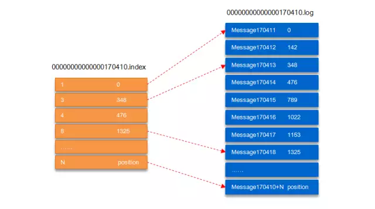

## Kafka名词解释
|  名词   | 解释  |
|  ----  | ----  |
| Broker  | 消息中间件处理节点，一个Kafka节点就是一个broker，一个或者多个Broker可以组成一个Kafka集群 |
| Topic  | Kafka根据topic对消息进行归类，发布到Kafka集群的每条消息都需要指定一个topic |
|  Producer |  消息生产者，向Broker发送消息的客户端 | 
|  Consumer  | 消息消费者，从Broker读取消息的客户端  /
| ConsumerGroup | 每个Consumer属于一个特定的Consumer Group，一条消息可以发送到多个不同的Consumer Group，但是一个Consumer Group中只能有一个Consumer能够消费该消息 | 
| Partition |  物理上的概念，一个topic可以分为多个partition，每个partition内部是有序的 |
| LEO | LogEndOffset的缩写，表示每个partition的log最后一条Message的位置 |
| HW | HighWatermark的缩写，是指consumer能够看到的此partition的位置 | 


### Topic
一个topic可以认为一个一类消息，每个topic将被分成多个partition
### Partition
每个partition在存储层面是**append log文件**。
任何发布到此partition的消息都会被**追加**到log文件的尾部，每条消息在文件中的位置称为offset(偏移量)，**offset为一个long型的数字**，它唯一标记一条消息。
每条消息都被append到partition中，是**顺序写磁盘**，因此效率非常高（经验证，顺序写磁盘效率比随机写内存还要高，这是Kafka高吞吐率的一个很重要的保证）<br>
每一条消息被发送到broker中，会根据partition规则选择被存储到哪一个partition。
如果partition规则设置的合理，所有消息可以均匀分布到不同的partition里，这样就实现了水平扩展。
（如果一个topic对应一个文件，那这个文件所在的机器I/O将会成为这个topic的性能瓶颈，而partition解决了这个问题）。
在创建topic时可以在$KAFKA_HOME/config/server.properties中指定这个partition的数量，也可以在topic创建之后去修改partition的数量。
```
# The default number of log partitions per topic.More partitions allow greater
# parallelism for consumption, but this willalso result in more files across
# the brokers.
num.partitions=3
```
在发送一条消息时，可以指定这个消息的key，producer根据这个key和partition机制来判断这个消息发送到哪个partition。
partition机制可以通过指定producer的partition.class这一参数来指定，该class必须实现kafka.producer.Partitioner接口。
  
### Kafka如何实现高可靠？
Kafka的高可靠性的保障来源于其健壮的副本（replication）策略。通过调节其副本相关参数，可以使得Kafka在性能和可靠性之间运转的游刃有余。
Kafka从0.8.x版本开始提供partition级别的复制,replication的数量可以在$KAFKA_HOME/config/server.properties中配置（default.replication.refactor）。

### Kafka文件如何存储？
设置参数log.dirs=/tmp/kafka-logs，创建topic  kafka-topics.sh --create--zookeeper localhost:2181 --partitions 4 --topic topic_test--replication-factor 4
在/tmp/kafka-logs目录中可以看到生成了4个目录：
```
drwxr-xr-x 2 root root topic_test-0
drwxr-xr-x 2 root root topic_test-1
drwxr-xr-x 2 root root topic_test-2
drwxr-xr-x 2 root root topic_test-3
```
在Kafka文件存储中，同一个topic下有多个不同的partition，每个partiton为一个**目录**，partition的名称规则为：
**topic名称+有序序号**，第一个序号从0开始计，最大的序号为partition数量减1，partition是实际物理上的概念，而topic是逻辑上的概念
#### Paratition 文件夹
每个partition(目录)相当于一个巨型文件被平均分配到多个大小相等的segment(段)数据文件中（每个segment 文件中消息数量不一定相等）这种特性也方便old segment的删除，即方便已被消费的消息的清理，提高磁盘的利用率。
每个partition只需要支持顺序读写就行，segment的文件生命周期由服务端配置参数（log.segment.bytes，log.roll.{ms,hours}等若干参数）决定。
#### Segment组成
segment文件由两部分组成，分别为“.index”文件和“.log”文件，分别表示为segment索引文件和数据文件。这两个文件的命令规则为：
**partition全局的第一个segment从0开始，后续每个segment文件名为上一个segment文件最后一条消息的offset值，数值大小为64位，20位数字字符长度，没有数字用0填充，**如下：
```
00000000000000000000.index
00000000000000000000.log
00000000000000170410.index
00000000000000170410.log
00000000000000239430.index
00000000000000239430.log
```
<br>
如上图，“.index”索引文件存储大量的元数据，“.log”数据文件存储大量的消息索引文件中的元数据指向对应数据文件中message的物理偏移地址。<br>
其中以“.index”索引文件中的元数据[3, 348]为例，在“.log”数据文件表示第3个消息，即在全局partition中表示170410+3=170413个消息，该消息的物理偏移地址为348。<br>
##### 那么如何从partition中通过offset查找message呢？
```
以上图为例，读取offset=170418的消息
首先查找segment文件，其中00000000000000000000.index为最开始的文件
第二个文件为00000000000000170410.index（起始偏移为170410+1=170411）
而第三个文件为00000000000000239430.index（起始偏移为239430+1=239431）
所以offset=170418就落到了第二个文件之中。
其他后续文件可以依次类推，以其实偏移量命名并排列这些文件，然后根据二分查找法就可以快速定位到具体文件位置。
其次根据00000000000000170410.index文件中的[8,1325]定位到00000000000000170410.log文件中的1325的位置进行读取。
```
##### 怎么知道何时读完本条消息，否则就读到下一条消息的内容了？
需要联系到消息的物理结构了，消息都具有固定的物理结构<br>
包括：offset（8 Bytes）、消息体的大小（4 Bytes）、crc32（4 Bytes）、magic（1 Byte）、attributes（1 Byte）、key length（4 Bytes）、key（K Bytes）、payload(NBytes)等等字段，
可以确定一条消息的大小，即读取到哪里截止。
