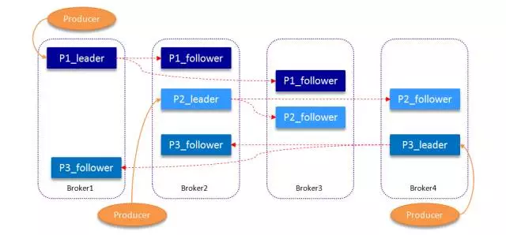
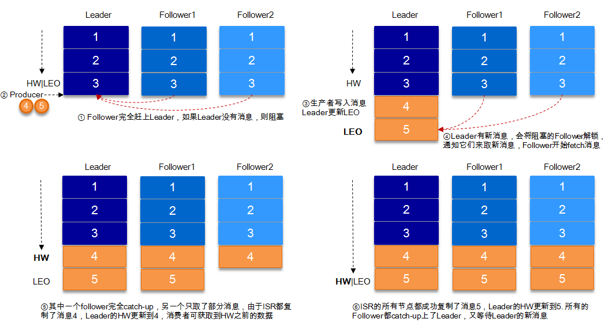

### Kafka复制同步原理
Kafka中topic的每个partition有一个预写式的日志文件，虽然partition可以继续细分为若干个segment文件，
但是对于上层应用来说可以将partition看成最小的存储单元（一个有多个segment文件拼接的“巨型”文件），
每个partition都由一些列有序的、不可变的消息组成，这些消息被连续的追加到partition中。
```
为了提高消息的可靠性，Kafka每个topic的partition有N个副本（replicas），其中N(大于等于1)是topic的复制因子（replica fator）的个数。
Kafka通过多副本机制实现故障自动转移，当Kafka集群中一个broker失效情况下仍然保证服务可用。
在Kafka中发生复制时确保partition的日志能有序地写到其他节点上，N个replicas中，其中一个replica为leader，
其他都为follower, leader处理partition的所有读写请求，与此同时，follower会被动定期地去复制leader上的数据。
```

Kafka提供了数据复制算法保证，如果leader发生故障或挂掉，一个新leader被选举并被接受客户端的消息成功写入。<br>
Kafka确保从**同步副本列表中选举**一个副本为leader，或者说follower追赶leader数据。<br>
leader负责**维护和跟踪ISR**(In-Sync Replicas的缩写，表示副本同步队列，具体可参考下节)中所有follower滞后的状态。<br>
当producer发送一条消息到broker后，leader**写入消息并复制**到所有follower。消息提交之后才被成功复制到所有的同步副本。<br>
**消息复制延迟受最慢的follower限制**，重要的是快速检测慢副本，如果follower“落后”太多或者失效，leader将会把它从ISR中删除<br>


#### ISR
ISR (In-Sync Replicas)，这个是指**副本同步队列**。<br>
副本数对Kafka的吞吐率是有一定的影响，但极大的增强了可用性。<br>
默认情况下Kafka的replica数量为1，即每个partition都有一个唯一的leader，为了确保消息的可靠性，通常应用中将其值(由broker的参数offsets.topic.replication.factor指定)大小设置为大于1，比如3。<br>
**所有的副本（replicas）统称为Assigned Replicas，即AR**。<br>
**ISR是AR中的一个子集**，由leader维护ISR列表，follower从leader同步数据有一些延迟
（包括延迟时间replica.lag.time.max.ms和延迟条数replica.lag.max.messages两个维度, 当前最新的版本0.10.x中只支持replica.lag.time.max.ms这个维度），
任意一个超过阈值都会把follower**剔除**出ISR, 存入OSR（Outof-Sync Replicas）列表，新加入的follower也会先存放在OSR中。AR=ISR+OSR。
Kafka 0.10.x版本后移除了replica.lag.max.messages参数，只保留了replica.lag.time.max.ms作为ISR中副本管理的参数。

#### HW
HW俗称高水位，HighWatermark的缩写，取一个partition对应的ISR中最小的LEO作为HW<br>
**consumer最多只能消费到HW所在的位置**。<br>
另外每个replica都有HW,leader和follower各自负责更新自己的HW的状态。
对于leader新写入的消息，consumer不能立刻消费，leader会等待该消息被所有ISR中的replicas同步后更新HW，此时消息才能被consumer消费。<br>
就保证了如果leader所在的broker失效，该消息仍然可以从新选举的leader中获取。对于来自内部broKer的读取请求，没有HW的限制。<br>

