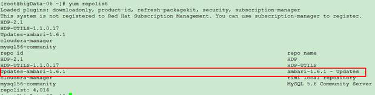

在生产环境中，应该是没有外网链接的环境，或者做了外网隔离，因此在离线环境下搭建集群很有价值。在内网集群中搭建yum服务器，安装ambari和hadoop集群，是一种比较好的解决思路。
### 安装步骤
1. 搭建Yum源服务器
2. 安装MySQL服务
3. 安装Ambari服务
4. 安装Hadoop组件
### 准备工作
下载对应的tar包：
1. ambari：集群管理工具
2. hdp：hadoop的所有包
3. hdp-utils：hadoop之外的其他依赖包
 
**官方tar包下载汇总地址：**
```
https://docs.hortonworks.com/HDPDocuments/Ambari-2.4.2.0/bk_ambari-installation/content/ambari_repositories.html
CentOS 6
http://public-repo-1.hortonworks.com/ambari/centos6/2.x/updates/2.4.2.0/ambari-2.4.2.0-centos6.tar.gz 
http://public-repo-1.hortonworks.com/HDP-UTILS-1.1.0.20/repos/centos6/HDP-UTILS-1.1.0.20-centos6.tar.gz
http://public-repo-1.hortonworks.com/HDP/centos6/2.x/updates/2.4.3.0/HDP-2.4.3.0-centos6-rpm.tar.gz
CentOS 7
http://public-repo-1.hortonworks.com/ambari/centos7/2.x/updates/2.4.2.0/ambari-2.4.2.0-centos7.tar.gz
http://public-repo-1.hortonworks.com/HDP/centos7/2.x/updates/2.4.3.0/HDP-2.4.3.0-centos7-rpm.tar.gz 
http://public-repo-1.hortonworks.com/HDP-UTILS-1.1.0.20/repos/centos7/HDP-UTILS-1.1.0.20-centos7.tar.gz
```
### 安装过程
#### 搭建Yum源服务器
1. 安装http server
在cluster-01上安装apaceh http服务。检查是否已经安装apache http服务。如果没有出现目录信息，则说明没有安装。<br>
安装成功之后，apache工作目录默认在/var/www/html
```
[root@cluster-01 ~]$ which httpd
[root@cluster-01 ~]$ sudo yum install httpd
```
```
[root@cluster-01 ~]$ netstat -nltp | grep 80     检查端口是否占用，apache http服务使用80端口。如果有占用情况，安装完毕之后需要修改apache http服务的端口号：
[root@cluster-01 ~]$ sudo vi /etc/httpd/conf/httpd.conf   修改监听端口，Listen 80为其他端口。
```
 
 ```
[root@cluster-01 ~]$ sudo service httpd start       可以在浏览器中查看http://cluster-01看到apache server的一些页面信息，表示启动成功。
```

2. 添加rpm包到repository中
    - 添加HDP 相关rpm包 下载HDP2.2.0的包<br>
        [HDP-2.2.0.0-centos6-rpm.tar.gz](http://public-repo-1.hortonworks.com/HDP/centos6/HDP-2.2.0.0-centos6-rpm.tar.gz)<br>
        [HDP-UTILS-1.1.0.20-centos6.tar.gz](http://public-repo-1.hortonworks.com/HDP-UTILS-1.1.0.20/repos/centos6/HDP-UTILS-1.1.0.20-centos6.tar.gz)<br>
        解压之后，会有HDP，HDP-UTILS-1.1.0.17的目录生成。
    - 下载ambari的包
    此处我们使用自己编译好的
        - ambari-server-1.6.1.1.noarch.rpm
        - ambari-agent-1.6.1.1.noarch.rpm<br>
     **注意：如果不使用己编译好的rpm包，也可以使用官网下载的**
    http://public-repo-1.hortonworks.com/ambari/centos6/ambari-1.6.1-centos6.tar.gz
 
3. 将这些包复制到/var/www/html/centos-6/
```
[root@cluster-01 html]# ll /var/www/html/
说明：
ambari目录：包含ambari-server，ambari-agent，ambari-log4j等rpm包
HDP目录：包含hadoop的生态圈的组件，比如hdfs，hive，hbase，mahout等
HDP-UTILS-1.1.0.17目录：包含HDP平台所包含的工具组件等，比如nagios，ganglia，puppet等
```

 
#### 创建Yum repository
在本地安装createrepo软件
```
[root@cluster-01 ~]$ which createrepo   如果出现在具体的目录，则说明已经安装
[root@cluster-01 ~]$ sudo yum install createrepo
[root@cluster-01 ~]$ sudo createrepo /var/www/html/centos-6/  创建repository
```
在ambari安装的节点做如下操作：
将/etc/yum.repos.d下的所有repo做备份，然后删除，创建一个ambari.repo
```

[root@cluster-01 ~]# vi /etc/yum.repos.d/ambari.repo
[ambari-2.x]
name=Ambari 2.x
baseurl=http://172.16.21.233/AMBARI-2.4.2.0/centos7/2.4.2.0-136
gpgcheck=0
gpgkey=http://172.16.21.233/AMBARI-2.4.2.0/centos7/2.4.2.0-136/RPM-GPG-KEY/
enabled=1   
priority=1
 
[Updates-ambari-2.4.2.0]
name=ambari-2.4.2.0 - Updates
baseurl=http://172.16.21.233/AMBARI-2.4.2.0/centos7/2.4.2.0-136/
enabled=1
priority=1
 
注意：
baseurl=http://<your server IP>/ambari/centos6/1.x/updates/1.6.1
ambari/centos6/1.x/updates/1.6.1与yum repository地址相对应。可以在浏览器中


[root@cluster-01 ~]$ sudo yum clean all  清除缓存
[root@cluster-01 ~]$ sudo yum repolist  如果出现仓库的名称等输出，则说明配置成功。
 
```


### 安装MySQL服务
http://dev.mysql.com/downloads/mysql/5.6.html#downloads
 
#### 安装
```
[root@cluster-02 ~]$ sudo yum install mysql-server
[root@cluster-02 ~]$ sudo service mysqld start
[root@cluster-02 root]$ sudo yum install mysql-connector-java   安装MySQL JDBC Connector
```
 
#### 配置
```
[root@cluster-02 ~]# service mysqld start
[root@cluster-01 ~]$ sudo /usr/bin/mysql_secure_installation
```

 
- 为ambari创建数据库，配置相应用户和权限
```
[root@cluster-02 ~]# mysql -u root –p
mysql> create database ambari;
mysql> use ambari;
mysql>
CREATE USER 'ambari'@'%' IDENTIFIED BY 'ambari';
GRANT ALL PRIVILEGES ON *.* TO 'ambari'@'%';
CREATE USER 'ambari'@'localhost' IDENTIFIED BY 'ambari';
GRANT ALL PRIVILEGES ON *.* TO 'ambari'@'localhost';
CREATE USER 'ambari'@'b07' IDENTIFIED BY 'ambari';
GRANT ALL PRIVILEGES ON *.* TO 'ambari'@'b07';
FLUSH PRIVILEGES;
```

### 安装Ambari-server
#### 安装
```
[root@cluster-02 root]# yum install ambari-server  如果不行，就用yum localinstall ambari-server 本地安装，不通过yum 源
[root@cluster-02 root]# ambari-server setup
Daemon运行的账号设置
Customize user account for ambari-server daemon [y/n] (n)?     输入：y
Enter user account for ambari-server daemon (root):    输入：root
 
检查防火墙是否关闭
Adjusting ambari-server permissions and ownership...
Checking firewall...
WARNING: iptables is running. Confirm the necessary Ambari ports are accessible. Refer to the Ambari documentation for more details on ports.
OK to continue [y/n] (y)?
输入：y
 
检查JDK
Checking JDK...
[1] - Oracle JDK 1.7 + Java Cryptography Extension (JCE) Policy Files 7
[2] - Oracle JDK 1.6 + Java Cryptography Extension (JCE) Policy Files 6
[3] - Custom JDK
==============================================================================
Enter choice (1):
输入：3
输入：/usr/local/jdk1.7.0_51/  （jdk的home，根据情况输入）
 
Choose one of the following options:
[1] - PostgreSQL (Embedded)
[2] - Oracle
[3] - MySQL
[4] - PostgreSQL
==============================================================================
Enter choice (1):
输入：3
 
Hostname (localhost):
Port (3306):
Database Name (ambari):
Username (ambari):
输入：（什么也不输入，直接“回车”）
 
Enter Database Password (cluster):
Re-enter password:
输入：ambari
```
**可能报错：**
```
WARNING: Before starting Ambari Server, you must copy the MySQL JDBC driver JAR file to /usr/share/java
这个时候只需要下载对应的jdbc jar包放到这个目录即可
 /usr/share/java
/usr/lib/ambari-server/

WARNING: Before starting Ambari Server, you must run the following DDL against the database to create the schema: /var/lib/ambari-server/resources/Ambari-DDL-MySQL-CREATE.sql
Proceed with configuring remote database connection properties [y/n] (y)?
输入：y
 
注意，此刻需要切换到mysql中执行相应脚本操作。
需要登录到mysql数据库，执行以下脚本Ambari-DDL-MySQL-CREATE.sql
[root@cluster-02 ~]# mysql -u root –p
 
mysql> use ambari;
Database changed
 
mysql> source /var/lib/ambari-server/resources/Ambari-DDL-MySQL-CREATE.sq
执行脚本，成功。
 
验证脚本是否初始化成功，出现以下table列表。
mysql> show tables;
+-------------------------------+
| Tables_in_ambari|
+-------------------------------+
| ClusterHostMapping |
| QRTZ_BLOB_TRIGGERS |
| QRTZ_CALENDARS |
| QRTZ_CRON_TRIGGERS|
| QRTZ_FIRED_TRIGGERS |
| QRTZ_JOB_DETAILS |
| QRTZ_LOCKS |
 


```
#### 启动
```
[root@cluster-02 root]# ambari-server start
Using python  /usr/bin/python2.6
Starting ambari-server
Ambari Server running with 'root' privileges.
Organizing resource files at /var/lib/ambari-server/resources...
Server PID at: /var/run/ambari-server/ambari-server.pid
Server out at: /var/log/ambari-server/ambari-server.out
Server log at: /var/log/ambari-server/ambari-server.log
Waiting for server start....................
Ambari Server 'start' completed successfully.
启动成功。
登录http://<Your server IP>:8080
```

 
（四）安装Ambari Agent 和Hadoop组件
1. 每台机器安装好jdk 确保每台机器上安装好jdk，并配置好java home
2. 选择版本，配置仓库<br>

配置repository地址<br>

 
3. 安装机器host或机器注册<br>
<br>
机器ip或hostname，privatekey或密码，此账号必须要有root权限<br>
 

4. 确认机器安装和agent安装<br>
 
5. 选择服务： hdfs，yarn，mapreduce2，tez，hive，pig，zookeeper，Ambari Metrics，spark，slider
6. 选择master  根据页面来选择某些组件安装到某些机器上，合理配置即可
7. 自定义服务
 <br>
 
点击advance，进入高级配置：<br>
将其中的所有的存储目录，log目录都改到/mnt/目录下面<br>
  

<br>添加hive服务
<br>数据库相关的账号，密码：XXXX
<br>hive的meta数据：XXX  XXX
<br>log search granfana：XXX XXX
<br>SmartSense ： admin XXX
8. review<br>
  <br>
9. 安装<br>
  <br>
10. 最后安装好的进入页面<br>
  <br>

### FAQ
1. 在安装过程中可能会报错，yum 安装报 关于Public key for *.rpm is not installed 的解决方法
```
解决：需要安装public key
wget http://172.16.21.233/AMBARI-2.4.2.0/centos7/2.4.2.0-136/RPM-GPG-KEY/RPM-GPG-KEY-Jenkins
rpm –import RPM-GPG-KEY-Jenkins
```

2. 安装hive的过程中，出现connection exception的异常
```
解决：按照官网提供的提示，执行，将jdbc注册到server中
ambari-server setup --jdbc-db=mysql --jdbc-driver=/usr/lib/ambari-server/mysql-connector-java-5.1.39.jar
```
3. 修改路径，所有的数据文件，日志文件建议修改到最大目录，并做好规整
 
### 参考资料
[Ambari安装文档](https://cwiki.apache.org/confluence/display/AMBARI/Installation+Guide+for+Ambari+1.6.1)
[其他安装方式参考](https://docs.hortonworks.com/HDPDocuments/Ambari-2.4.2.0/bk_ambari-installation/content/hdp_25_repositories.html)
