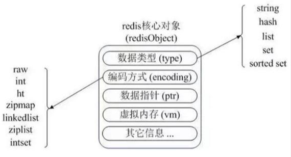
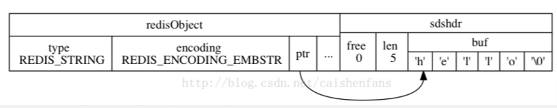
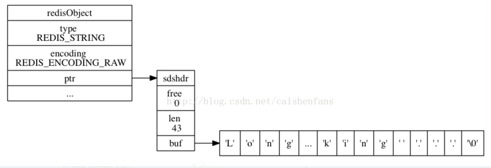
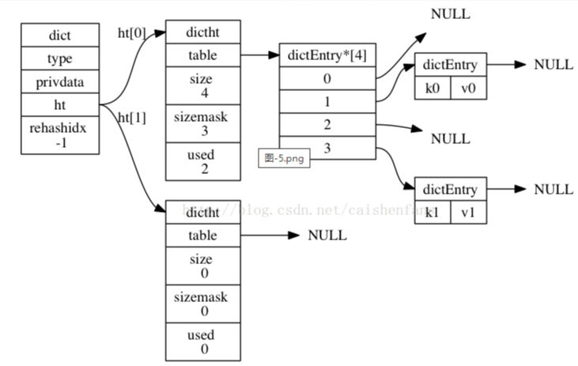
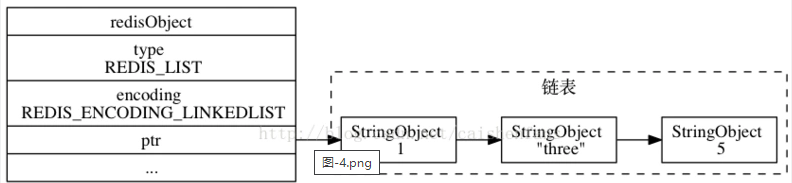
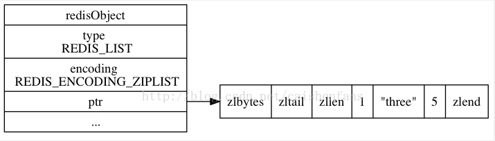

# 核心对象
**5种存储类型和8种数据结构** 

## 数据结构
- **REDIS_ENCODING_INT** long类型整数
- **REDIS_ENCODING_EMBSTR** embstr编码的动态字符串
    - embstr的创建只需分配一次内存 

- **REDIS_ENCODING_RAW** 简单动态字符串
    - SDS简单动态字符串
        - len buf中已经占有的长度,分别以uint8，uint32，uint64表示
        - free buf 中未使用的缓冲区长度
        - buf[]实际保存字符串数据+"\0"
    - 当len小于IMB（1024*1024）时增加字符串分配空间大小为原来的2倍，当len大于等于1M时每次分配 额外多分配1M的空间 

- **REDIS_ENCODING_HT** 字典
    - 由dict结构实现其中的指针dicht ht[2]指向两个哈希表
    - dicht[0] 是用于真正存放数据，dicht[1]一般在哈希表元素过多进行rehash的时候用于中转数据 

- **REDIS_ENCODING_LINKEDLIST** 双端链表
    - 双向链表，节点存放pre和next两个指针，每增加一个node的时候就需要malloc一块内存 

- **REDIS_ENCODING_ZIPLIST** 压缩列表
    - 压缩链表，存储的内容都是在连续的内存区域当中的 
   
- **REDIS_ENCODING_INTSET** 整数合集
- **REDIS_ENCODING_SKIPLIST** 跳跃表和字典
 
## 数据类型
### String REDIS_STRING
- 字符串长度不能超过512MB
- 编码可以是int、raw或者embstr
- set数字的时候用int
- 字符串长度大于39个字节用raw
- 小于39字节用embstr
- 一个字符串的内容可以转换为long，那么该字符串就会被转换成为long类型，对象的ptr就会指向该long，并且对象类型也用int类型表示

### hash REDIS_HASH
- 底层实现可以是ziplist或者hashtable
- ziplist中的哈希对象是按照key1,value1,key2,value2这样的顺序存放来存储
- 列表所有字符串元素长度小于64并且元素数量小于512用ziplist
- 其他情况用hashtable

### list REDIS_LIST
- 存储2^32-1个元素
- 编码可以是ziplist或者linkedlist
- 列表所有字符串元素长度小于64并且元素数量小于512用ziplist
- 其他情况用linkedlist

### set REDIS_SET
- 最多可以存储2^32-1个元素
- 编码可以是intset或者hashtable
- 所有元素都是整数并且元素数量小于512 用insert
- 其他情况用hashtable

### zset REDIS_ZSET
- 编码可能是ziplist或者 skiplist与dict结合
- ziplist作为集合，member和score顺序存放。按照score从小到大顺序排列
- 元素数量小于128并且元素长度小于64 用ziplist
- 其余情况用跳表
 