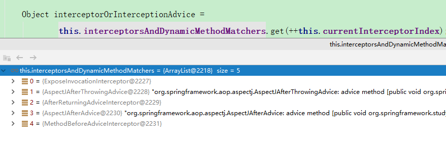
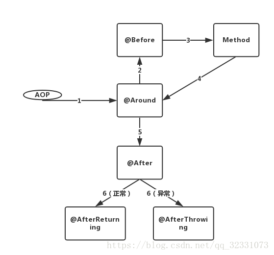

# AOP实现原理
## 用例
```java
@Configuration
@ComponentScan("org.springframework.study.aop")
@EnableAspectJAutoProxy
public class AOPConfig {
}
@Aspect
@Component
public class StudyAspect {
	@Pointcut("execution(* org.springframework.study.aop.service.*.*(..))") // 切点表达式
	private void pointcut() {} // 切点签名方法
	@Before("pointcut()")
	public void before(JoinPoint jp){ System.out.println("StudyAspect --- before"); }
	@After("pointcut()")
	public void after(JoinPoint jp){ System.out.println("StudyAspect --- After"); }
	@AfterReturning("pointcut()")
	public void afterReturn(JoinPoint jp){ System.out.println("StudyAspect --- afterReturn"); }
	@AfterThrowing("pointcut()")
	public void afterThrowing(JoinPoint jp){ System.out.println("StudyAspect --- AfterThrowing"); }
}
@Component
public class HelloService {
	public void test(){ System.out.println("HelloService  test()"); }
}

public static void main(String[] args) {
    AnnotationConfigApplicationContext applicationContext = new AnnotationConfigApplicationContext(AOPConfig.class);
    HelloService bean = applicationContext.getBean(HelloService.class);
    bean.test();
}
```
## @Pointcut 书写规则
@Pointcut("execution(* transfer(..))")
private void ponitcut() {} // 切点签名方法

- execution: 用来匹配方法的执行
- within: 用来匹配特定类内部方法执行
- this: 用来匹配代理对象是特定类型（Spring AOP proxy is an instance of the given type）
- target: 用来匹配目标对象是特定类型（Object being proxied is an instance of the given type）target和this的区别可以参考：https://my.oschina.net/OttoWu/blog/3304147/print
- args: 用来匹配参数是特定类型
- @args: 参数上有特定注解
- @annotation: 用来匹配加了特定注解的方法
- @target: 用来匹配加了特定注解的类
- @within: 用来匹配加了特定注解的类
```
execution(public * *(..))任意返回值，任意方法名，任意参数，只要是public就可以
execution(* set*(..))：以set开头的方法
execution(* com.mouxf.service.AccountService.*(..))AccountService的所有方法
execution(* com.mouxf.service.*.*(..)) service包下面的所有类的所有方法
execution(* com.mouxf.service..*.*(..)) service包以及子包下面的所有类的所有方法
within(com.mouxf.service.*)：service包里面
within(com.mouxf.service..*)：service包以及子包里面
this(com.mouxf.service.AccountService)：实现了AccountService的代理对象
target(com.mouxf.service.AccountService)：实现了AccountService的目标对象
args(java.io.Serializable)：方法只有一个参数，并且实现了Serializable
args(java.io.Serializable, java.lang.String,..)：方法的前两个参数是Serializable和String
@target(org.springframework.transaction.annotation.Transactional)目标对象上有Transactional注解
@within(org.springframework.transaction.annotation.Transactional)目标对象上有Transactional注解
@annotation(org.springframework.transaction.annotation.Transactional)方法上定义了Transactional注解
@args(com.xyz.security.Classified)：方法只有一个参数，并且参数上有Classified注解
bean(tradeService)：名字叫tradeService的bean
bean(*Service)：bean的名字以Service结尾
```
## SpringBean 中的代理是怎么生成的？
断点在 **bean.test();** 可以观察到，当前bean已经是代理类。依照之前IOC创建Bean，猜测代理类也是在其中几行代码中生成
```
AbstractAutowireCapableBeanFactory#doCreateBean
AbstractAutowireCapableBeanFactory#initializeBean(String, Object,RootBeanDefinition)
```
两个方法分别打上断点，调试过程中可以看到，在生成HelloService的时候还只是一个普通类，但是在运行initializeBean()中的applyBeanPostProcessorsAfterInitialization(wrappedBean, beanName)后
对应的实例对象已经变成了代理对象。

<br>
仔细观察getBeanPostProcessors()方法，会得到一个 AnnotationAwareAspectJAutoProxyCreator类。继续查看AnnotationAwareAspectJAutoProxyCreator类中的。调用父类AbstractAutoProxyCreatorwrapIfNecessary(Object bean, String beanName, Object cacheKey)方法
```java
wrapIfNecessary(){
 调用 createProxy(Class<?> beanClass, @Nullable String beanName,@Nullable Object[] specificInterceptors, TargetSource targetSource);
}
createProxy(){
    return proxyFactory.getProxy(getProxyClassLoader());
}
public Object getProxy(@Nullable ClassLoader classLoader) {
    return createAopProxy().getProxy(classLoader);
}
protected final synchronized AopProxy createAopProxy() {
    return getAopProxyFactory().createAopProxy(this);
}
```
```java
DefaultAopProxyFactory.java
//这一步就开始确定当前代理是使用 JDKDynamic 还是使用cglib
@Override
public AopProxy createAopProxy(AdvisedSupport config) throws AopConfigException {
    if (config.isOptimize() || config.isProxyTargetClass() || hasNoUserSuppliedProxyInterfaces(config)) {
        Class<?> targetClass = config.getTargetClass();
        if (targetClass == null) {
            throw new AopConfigException("TargetSource cannot determine target class: " +
                    "Either an interface or a target is required for proxy creation.");
        }
        if (targetClass.isInterface() || Proxy.isProxyClass(targetClass)) { //判断是否是接口或者已经是代理类 就用JDK动态代理
            return new JdkDynamicAopProxy(config); 
        }
        return new ObjenesisCglibAopProxy(config);
    }
    else {
        return new JdkDynamicAopProxy(config);
    }
}
仅查看JdkDynamicAopProxy.getProxy()
@Override
public Object getProxy(@Nullable ClassLoader classLoader) {
    if (logger.isDebugEnabled()) {
        logger.debug("Creating JDK dynamic proxy: target source is " + this.advised.getTargetSource());
    }
    Class<?>[] proxiedInterfaces = AopProxyUtils.completeProxiedInterfaces(this.advised, true);
    findDefinedEqualsAndHashCodeMethods(proxiedInterfaces);
    return Proxy.newProxyInstance(classLoader, proxiedInterfaces, this); //非常熟悉的Java动态代理API
}
```
看到这里，其实大致已经能够知道，AOP利用了Spring提供的BeanPostProcessors的postProcessAfterInitialization()方法生成代理类。并且在生成代理类之后放入IOC中并在getBean的时候返回代理类

## Spring中环绕是如何实现的？
断点打在bean.test()处，在代码执行过程中会发现是先进入代理方法中去，在方法执行过程中会进入到ReflectiveMethodInvocation.proceed()方法中。
### ReflectiveMethodInvocation.proceed()
```java
interceptorsAndDynamicMethodMatchers 包含了当前方法配置的环绕方法.在代码执行过程中是不断的循环调用proceed()方法。
@Override
@Nullable
public Object proceed() throws Throwable {
    // We start with an index of -1 and increment early.
    if (this.currentInterceptorIndex == this.interceptorsAndDynamicMethodMatchers.size() - 1) {
        return invokeJoinpoint();
    }
    Object interceptorOrInterceptionAdvice = this.interceptorsAndDynamicMethodMatchers.get(++this.currentInterceptorIndex);
    if (interceptorOrInterceptionAdvice instanceof InterceptorAndDynamicMethodMatcher) {
        InterceptorAndDynamicMethodMatcher dm =
                (InterceptorAndDynamicMethodMatcher) interceptorOrInterceptionAdvice;
        if (dm.methodMatcher.matches(this.method, this.targetClass, this.arguments)) {
            return dm.interceptor.invoke(this);
        }
        else {
            return proceed();
        }
    }
    else {
        //传入当前ReflectiveMethodInvocation类，为invoke()中调用proceed()准备
        return ((MethodInterceptor) interceptorOrInterceptionAdvice).invoke(this); 
    }
}
```

### AspectJAfterThrowingAdvice.invoke()
mi为ReflectiveMethodInvocation类，在此次执行proceed()方法时，ReflectiveMethodInvocation类中的currentInterceptorIndex游标已经加1，循环到下一个Advice。
环绕过程中对异常的处理 当一层一层循环结束重新回到对标**StudyAspect.afterThrowing()** 后再返回具体内容
```java
public Object invoke(MethodInvocation mi) throws Throwable {
    try {
        return mi.proceed();  
    }catch (Throwable ex) {
        if (shouldInvokeOnThrowing(ex)) {
        invokeAdviceMethod(getJoinPointMatch(), null, ex);
        }
        throw ex;
    }
}
```
### AfterReturningAdviceInterceptor.invoke()
```java
public Object invoke(MethodInvocation mi) throws Throwable {
    Object retVal = mi.proceed();
    this.advice.afterReturning(retVal, mi.getMethod(), mi.getArguments(), mi.getThis());
    return retVal;
}
```

### AspectJAfterAdvice
```java
	@Override
public Object invoke(MethodInvocation mi) throws Throwable {
    try {
        return mi.proceed();
    }finally {
        invokeAdviceMethod(getJoinPointMatch(), null, null);
    }
}
```
### MethodBeforeAdviceInterceptor
```java
@Override
public Object invoke(MethodInvocation mi) throws Throwable {
    this.advice.before(mi.getMethod(), mi.getArguments(), mi.getThis());
    return mi.proceed();
}
```
### 合并环绕代码
```java
public Object invoke(MethodInvocation mi) throws Throwable {
    try {
        try {
            this.advice.before(mi.getMethod(), mi.getArguments(), mi.getThis());
            return mi.proceed();  //这个位置是具体的方法逻辑
        }finally {
            invokeAdviceMethod(getJoinPointMatch(), null, null);
        }
        this.advice.afterReturning(retVal, mi.getMethod(), mi.getArguments(), mi.getThis()); //程序返回数据时执行
        return retVal;
    }catch (Throwable ex) {
        if (shouldInvokeOnThrowing(ex)) {
            invokeAdviceMethod(getJoinPointMatch(), null, ex);//程序异常执行的方法
        }
        throw ex;
    }
}
```
### 图解(侵删)

