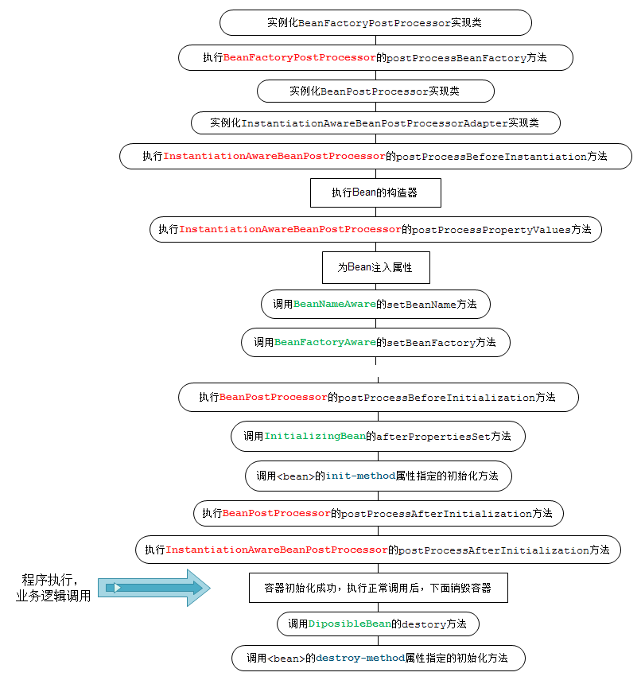

# Bean初始化过程高级特性
### Bean的生命周期
<br>
主要探究Bean的生命周期在代码中的表现形式，网上流传的大多是图中给的流程，这次探究在源码中的表现形式。
但还是需要自己动手实践才能发现真理
```java
//spring中初始化核心代码
@Override
public void refresh() throws BeansException, IllegalStateException {
    synchronized (this.startupShutdownMonitor) {
        prepareRefresh();
        ConfigurableListableBeanFactory beanFactory = obtainFreshBeanFactory();
        prepareBeanFactory(beanFactory);
        try {
            postProcessBeanFactory(beanFactory);
            invokeBeanFactoryPostProcessors(beanFactory);  //执行BeanFactoryPostProcessor.postProcessBeanFactory()方法
            registerBeanPostProcessors(beanFactory); //注册 BeanPostProcessor
            initMessageSource();
            initApplicationEventMulticaster();
            onRefresh();
            registerListeners();
            finishBeanFactoryInitialization(beanFactory);
            finishRefresh();
        }
}
```
### BeanFactoryPostProcessor
可以在Spring的Bean创建之前，修改bean的定义属性。Spring允许BeanFactoryPostProcessor在容器实例化任何其它bean之前读取配置元数据，并可以根据需要进行修改，
例如可以在此阶段添加Bean到IOC中。可以同时配置多个BeanFactoryPostProcessor，并通过设置'order'属性来控制各个BeanFactoryPostProcessor的执行次序。
```java
public class HelloNoService {
	public void test(){
		System.out.println("no @Component,but in Spring IOC");
	}
}

@Component
public class HelloBeanFactoryPostProcessor implements BeanFactoryPostProcessor {
	@Override
	public void postProcessBeanFactory(ConfigurableListableBeanFactory beanFactory) throws BeansException {
        beanFactory.registerSingleton("HelloNoService", new HelloNoService()); //通过这种方式注入Bean，适用于引用的jar包没办法添加 @Component之类的注解
		System.out.println("----  HelloBeanFactoryPostProcessor");  //断点打在此处
	}
}
public static void main(String[] args) {
    AnnotationConfigApplicationContext applicationContext = new AnnotationConfigApplicationContext(MainConfig.class);
    HelloNoService bean = applicationContext.getBean(HelloNoService.class);
    bean.test();
}
输出结果：
----  HelloBeanFactoryPostProcessor
no @Component,but in Spring IOC
```
```
Debug后在IDEA中的调用链
invokeBeanFactoryPostProcessors:177, PostProcessorRegistrationDelegate (org.springframework.context.support)
invokeBeanFactoryPostProcessors:706, AbstractApplicationContext (org.springframework.context.support)
refresh:533, AbstractApplicationContext (org.springframework.context.support)
<init>:88, AnnotationConfigApplicationContext (org.springframework.context.annotation)
main:10, MainTest (org.springframework.study.ioc)
```
AbstractApplicationContext#invokeBeanFactoryPostProcessors()方法中执行了postProcessBeanFactory()方法。在代码中Spring会将实现了BeanFactoryPostProcessor的类封装在Collection中，
然后调用PostProcessorRegistrationDelegate.invokeBeanFactoryPostProcessors()方法循环执行每个BeanFactoryPostProcessor.postProcessBeanFactory()。即 HelloBeanFactoryPostProcessor
在程序运行过程中会被添加进入一个Collection中，并传入invokeBeanFactoryPostProcessors()方法中执行postProcessBeanFactory()
```java
PostProcessorRegistrationDelegate.java

private static void invokeBeanFactoryPostProcessors(
        Collection<? extends BeanFactoryPostProcessor> postProcessors, ConfigurableListableBeanFactory beanFactory) {

    for (BeanFactoryPostProcessor postProcessor : postProcessors) {
        postProcessor.postProcessBeanFactory(beanFactory);
    }
}
```

### BeanPostProcessor
**非常重要的一个Spring特性**。在Bean实例化过程中可以增强Bean的性质，Spring AOP的代理实现就是在这种特性中实现的
```java
@Component
public class HelloBeanPostProcessor implements BeanPostProcessor {
	public HelloBeanPostProcessor(){
		System.out.println("init HelloBeanPostProcessor");
	}
	@Override
	public Object postProcessBeforeInitialization(Object bean, String beanName) throws BeansException {
		if(beanName.equals("helloServiceImpl"))
			System.out.println("-- HelloBeanPostProcessor before:" +beanName); //断点打在此处，观察IDEA中的方法调用栈
		return bean;
	}
	@Override
	public Object postProcessAfterInitialization(Object bean, String beanName) throws BeansException {
		if(beanName.equals("helloServiceImpl"))
			System.out.println("-- HelloBeanPostProcessor after:" + beanName); //断点打在此处,观察IDEA中的方法调用栈
		return bean;
	}
}
HelloService bean = applicationContext.getBean(HelloService.class);
bean.test();
输出结果：
init HelloBeanPostProcessor
-- HelloBeanPostProcessor before:helloServiceImpl
-- HelloBeanPostProcessor after:helloServiceImpl
hello spring
```
初始化Bean过程中，在调用AbstractAutowireCapableBeanFactory#initializeBean(java.lang.String, java.lang.Object, org.springframework.beans.factory.support.RootBeanDefinition)中
```java
public initializeBean(){
    Object wrappedBean = bean;
    if (mbd == null || !mbd.isSynthetic()) {
        wrappedBean = applyBeanPostProcessorsBeforeInitialization(wrappedBean, beanName); //执行Before方法
    }
    try {
        invokeInitMethods(beanName, wrappedBean, mbd); //Bean实现了InitializingBean，执行 InitializingBean.afterPropertiesSet()方法
    }
    if (mbd == null || !mbd.isSynthetic()) {
        wrappedBean = applyBeanPostProcessorsAfterInitialization(wrappedBean, beanName); //执行After方法
    }
}

//Before方法
public Object applyBeanPostProcessorsBeforeInitialization(Object existingBean, String beanName)  
        throws BeansException {

    Object result = existingBean;
    //获取Spring中的所有BeanPostProcessor循环执行Before方法。
    //AOP的实现也是在这一步中实现，此处返回值是AOP的代理对象了
    for (BeanPostProcessor processor : getBeanPostProcessors()) { 
        Object current = processor.postProcessBeforeInitialization(result, beanName);
        if (current == null) {
            return result;
        }
        result = current;
    }
    return result;
}
```
### @PostConstruct
PostConstruct 注释用于在依赖关系注入完成之后需要执行的方法上，以执行任何初始化。
```java
@PostConstruct
public void testPostConstruct(){
    System.out.println("PostConstruct"); //断点打在此处
}
//程序运行结果配合上面给的代码可以看到输出结果是在  BeanPostProcessor before 和 BeanPostProcessor after 之间运行的
```
调试代码过程中会发现IDEA中的方法栈  applyBeanPostProcessorsBeforeInitialization() ,当前对应的BeanPostProcessor为CommonAnnotationBeanPostProcessor。
CommonAnnotationBeanPostProcessor **extend** InitDestroyAnnotationBeanPostProcessor 实质上是调用InitDestroyAnnotationBeanPostProcessor.postProcessBeforeInitialization()
```java
public Object postProcessBeforeInitialization(){
    LifecycleMetadata metadata = findLifecycleMetadata(bean.getClass());
    try {
        metadata.invokeInitMethods(bean, beanName);
    }
}
buildLifecycleMetadata(){
    final List<LifecycleElement> currInitMethods = new ArrayList<>(); //初始化方法
    final List<LifecycleElement> currDestroyMethods = new ArrayList<>(); //销毁方法
    ReflectionUtils.doWithLocalMethods(targetClass, method -> {
        if (this.initAnnotationType != null && method.isAnnotationPresent(this.initAnnotationType)) {  //this.initAnnotationType在构造方法上被初始化
            LifecycleElement element = new LifecycleElement(method);
            currInitMethods.add(element);
            if (debug) {
                logger.debug("Found init method on class [" + clazz.getName() + "]: " + method);
            }
        }
        if (this.destroyAnnotationType != null && method.isAnnotationPresent(this.destroyAnnotationType)) {
            currDestroyMethods.add(new LifecycleElement(method));
            if (debug) {
                logger.debug("Found destroy method on class [" + clazz.getName() + "]: " + method);
            }
        }
    });
}
public CommonAnnotationBeanPostProcessor() {
    setOrder(Ordered.LOWEST_PRECEDENCE - 3);
    setInitAnnotationType(PostConstruct.class);
    setDestroyAnnotationType(PreDestroy.class);
    ignoreResourceType("javax.xml.ws.WebServiceContext");
}
```
总结：@PostConstruct能够实现Bean实例化的时候运行方法，原理是使用了BeanPostProcessor的before方法。另外在CommonAnnotationBeanPostProcessor中配置好对应的初始化对应的注解标志。
在后续程序运行过程中判断方法上是否包含了对应的注解，包含话最红调用method.invoke()执行方法(程序最终调用LifecycleElement.invoke()方法执行)。
同理，发现CommonAnnotationBeanPostProcessor中也有PreDestroy注解，是否可以猜想到Bean销毁阶段也在这个类中执行，需要验证


