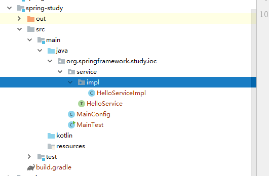

# 编译Spring源码 5.x
1. 准备环境 Java8、gradle4.9
2. 下载spring源码 [github](https://github.com/spring-projects/spring-framework)。切换分支到5.x下载
3. 引入导入IDEA工程(耗时)
4. 执行build方法

## 阅读源码准备
1. 对Spring有一定的了解，知道各种功能怎么使用
2. 在阅读的过程中带着问题阅读，后续会对每个功能题目，并探索方案。由于Spring很庞大没办法细致到每行代码都弄明白，了解Spring思想是关键
3. 通过Debug模式来阅读源码，测试代码运行过程中在IDEA中观察方法调用栈，根据调用栈逆推代码执行流程及数据转换

## 创建新模块测试

```java
@Configuration
@ComponentScan("org.springframework.study.ioc.**")
public class MainConfig {}

public class MainTest {
	public static void main(String[] args) {
		AnnotationConfigApplicationContext applicationContext = new AnnotationConfigApplicationContext(MainConfig.class);
		HelloService bean = applicationContext.getBean(HelloService.class);
		bean.test();
	}
}

运行结果：
hello spring
```
### 问题列表(持续更新)
 - 导入项目遇见问题：No such property: immutableValues for class: org.gradle.api.internal.tasks.DefaultTaskDependency
 ```
 修改 spring-beans.gradle,注释掉
compileGroovy.dependsOn = compileGroovy.taskDependencies.values - "compileJava" 
compileKotlin.dependsOn(compileGroovy) 
compileKotlin.classpath += files(compileGroovy.destinationDir) 
替换成:
def deps = compileGroovy.taskDependencies.immutableValues + compileGroovy.taskDependencies.mutableValues 
compileGroovy.dependsOn = deps - "compileJava" 
compileKotlin.dependsOn(compileGroovy) 
compileKotlin.classpath += files(compileGroovy.destinationDir) 
```
 - spring-core项目里丢失了两个jar 包
```
bulid.gradle 文件里在找到了两个 task  cglibRepackJar和objenesisRepackJar 执行这两个Task
```
 - spring-oxm 项目丢失了jaxb和xmlbeans jar 包
```
spring-oxm中执行gradle compileTestJava 
```
 - 新创建的模块运行main方法， Error:(160, 32) java: 找不到符号 符号: 变量InstrumentationSavingAgent 位置:
```
在新模块中加入  compile(project(":spring-instrument"))
或者修改spring-context中  optional(project(":spring-instrument"))  为  compile(project(":spring-instrument"))
```
