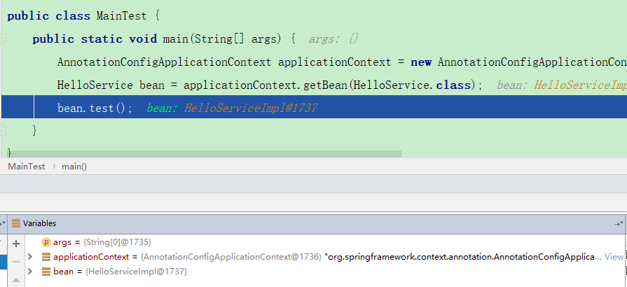
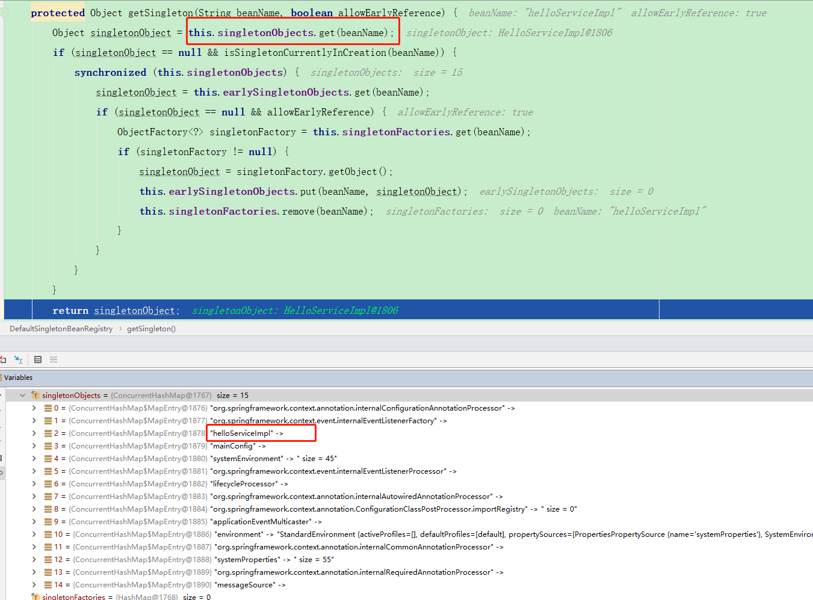

# IOC初探索
```java
public static void main(String[] args) {
   1. AnnotationConfigApplicationContext applicationContext = new AnnotationConfigApplicationContext(MainConfig.class);
   2. HelloService bean = applicationContext.getBean(HelloService.class);
   3. bean.test();
}
```
###  HelloService是在1 2 3 哪个阶段被实例化？
Debug调试下，可以看到在步骤3时，bean已经是被实例化。
<br>
再探索步骤2。Debug调试进入方法后。以下只给出关键类中关键方法
```java
public class DefaultListableBeanFactory{
    public <T> T getBean(Class<T> requiredType, @Nullable Object... args) throws BeansException {
        NamedBeanHolder<T> namedBean = resolveNamedBean(requiredType, args); //此方法获取bean实例
        if (namedBean != null) {
            return namedBean.getBeanInstance();
        }
        BeanFactory parent = getParentBeanFactory();
        if (parent != null) {
            return (args != null ? parent.getBean(requiredType, args) : parent.getBean(requiredType));
        }
        throw new NoSuchBeanDefinitionException(requiredType);
    }
}
```
最终调试后，在DefaultSingletonBeanRegistry.java中，找到了答案。原来在类中有ConcurrentHashMap singletonObjects 中已经存放好了对应的实例Bean。每次getBean的时候实际上就是从
Map中get数据。
<br>

### HelloService实例Bean什么时候被放入singletonObjects中？
使用反向推导实例化过程，寻找singletonObjects.put()代码。在在DefaultSingletonBeanRegistry中找到了put代码。
```java
protected void addSingleton(String beanName, Object singletonObject) {
    synchronized (this.singletonObjects) {
        this.singletonObjects.put(beanName, singletonObject);
        this.singletonFactories.remove(beanName);
        this.earlySingletonObjects.remove(beanName);
        this.registeredSingletons.add(beanName);
    }
}
```
条件断点打在此处，Debug运行程序可以看到在IDEA看到整个方法调用栈
```
AbstractApplicationContext#refresh
	AbstractApplicationContext#finishBeanFactoryInitialization
		DefaultListableBeanFactory#preInstantiateSingletons
			AbstractBeanFactory#getBean(java.lang.String)
				AbstractBeanFactory#doGetBean
					DefaultSingletonBeanRegistry#getSingleton(java.lang.String, org.springframework.beans.factory.ObjectFactory<?>)
						DefaultSingletonBeanRegistry#addSingleton(String beanName, ObjectFactory<?> singletonFactory)
							DefaultSingletonBeanRegistry#addSingleton(String beanName, Object singletonObject) 
```
在进入方法addSingleton(String beanName, Object singletonObject) 时，可以看到singletonObject已经是被实例化出来了
### HelloService什么时候被生成？
观察上一问给出的方法调用链里的源码addSingleton(String beanName, ObjectFactory<?> singletonFactory)并没有实例化的参数传入，
而在调用addSingleton(String beanName, Object singletonObject) 时就传入了已经实例化的Object。说明生成HelloService过程在addSingleton(String beanName, ObjectFactory<?> singletonFactory)方法中
```java
//addSingleton(String beanName, ObjectFactory<?> singletonFactory)  中生成实例数据的源码
singletonObject = singletonFactory.getObject();
//调用ObjectFactory.getObject()方法会到createBean中
AbstractAutowireCapableBeanFactory#createBean(java.lang.String, org.springframework.beans.factory.support.RootBeanDefinition, java.lang.Object[])
    Object beanInstance = doCreateBean(beanName, mbdToUse, args);
//最后在BeanUtils里面生成具体的ObjectBean
BeanUtils#instantiateClass(java.lang.reflect.Constructor<T>, java.lang.Object...){
    ReflectionUtils.makeAccessible(ctor);
    return (KotlinDetector.isKotlinType(ctor.getDeclaringClass()) ?
            KotlinDelegate.instantiateClass(ctor, args) : ctor.newInstance(args));
}
```