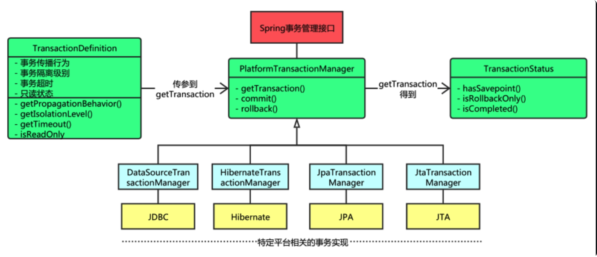

## **一、Java Spring 事务概述**

### **（一）事务的基本概念**

事务是指作为单个逻辑工作单元执行的一系列操作，这些操作要么全部成功完成，要么全部不执行。在数据库系统中，事务具有原子性、一致性、隔离性和持久性这四个特性，通常被称为 ACID 特性。

**1. 原子性（Atomicity）**：事务是最小的执行单位，不允许分割。事务中的所有操作要么全部成功执行，要么全部不执行，不存在部分成功的情况。例如在银行转账的例子中，从一个账户扣款并向另一个账户存款这两个操作必须同时成功或同时失败，不能出现只完成了其中一个操作的情况。

**2. 一致性（Consistency）**：事务应确保数据库的状态从一个一致状态转变为另一个一致状态。一致状态的含义是数据库中的数据应满足完整性约束。例如在银行系统中，转账前后账户的总金额应该保持不变，这就是一种一致性的要求。

**3. 隔离性（Isolation）**：多个事务并发执行时，一个事务的执行不应影响其他事务的执行。不同的事务应该相互隔离，就好像它们是在不同的时间顺序中执行一样。例如，一个事务在读取数据时，不应该看到其他事务未提交的数据修改，以避免出现脏读、不可重复读和幻读等问题。

**4. 持久性（Durability）**：已被提交的事务对数据库的修改应该永久保存在数据库中。即使系统发生故障，如断电、崩溃等，已提交的事务的结果也不应该丢失。

### **（二）Spring 事务管理的重要性**

在企业级应用开发中，数据库操作通常是复杂且关键的部分。如果没有良好的事务管理机制，可能会导致数据不一致、数据丢失等严重问题。Spring 的事务管理机制可以帮助开发者轻松地处理数据库事务，确保数据的完整性和一致性。

例如，在一个电商系统中，当用户下单时，需要同时更新订单表、库存表和用户账户表等多个数据表。如果在这个过程中出现问题，如库存不足但订单已经生成，或者用户账户扣款失败但订单已经提交，就会导致数据不一致。而 Spring 的事务管理可以确保这些操作要么全部成功，要么全部失败，从而避免出现数据不一致的情况。

### **（三）Spring 事务管理的实现方式**

Spring 提供了两种主要的事务管理方式：编程式事务管理和声明式事务管理。

**1. 编程式事务管理**

编程式事务管理是通过编写代码来实现事务的管理。Spring 中有两种方式可以进行编程式的事务管理，要么直接使用 PlatformTransactionManager，要么使用更方便的 TransactionTemplate。

使用 PlatformTransactionManager 进行编程式事务管理的示例代码如下：

```java
@Autowired
private PlatformTransactionManager transactionManager;
// 事务的属性
DefaultTransactionDefinition definition = new DefaultTransactionDefinition();
// 设置超时时间
definition.setTimeout(20);
...
TransactionStatus txStatus = transactionManager.getTransaction(definition);
try {
    // 业务逻辑实现
} catch (ApplicationException e) {
    transactionManager.rollback(txStatus);
    throw e;
} catch (RuntimeException e) {
    transactionManager.rollback(txStatus);
    throw e;
} catch (Error e) {
    transactionManager.rollback(txStatus);
    throw e;
}
transactionManager.commit(txStatus);
```
使用 TransactionTemplate 进行编程式事务管理的示例代码如下：

```java
public class UserAccountServiceImplextends JdbcDaoSupport implements UserAccountService {
    // 注入事物模板
    private TransactionTemplate transactionTemplate;
    public void setTransactionTemplate(TransactionTemplate transactionTemplate) {
        this.transactionTemplate = transactionTemplate;
    }
    @Override
    public void remittance(String remitTer, String receiver, int money) {
        transactionTemplate.execute(new TransactionCallbackWithoutResult() {
            public void doInTransactionWithoutResult(TransactionStatus arg0) {
                outMoney(remitTer,money);
                // System.out.println(1/0);
                innerMoney(receiver,money);
            }
        });
    }

    private void outMoney(String remitTer, int money){
        String outSql="update user_account set money = money -? where username =?";
        this.getJdbcTemplate().update(outSql, money,remitTer);
    }
    private void innerMoney(String receiver, int money){
        String inSql="update user_account set money = money +? where username =?";
        this.getJdbcTemplate().update(inSql, money,receiver);
    }

}
```
**2. 声明式事务管理**

声明式事务管理推荐使用（代码侵入性最小），实际是通过 AOP 实现（基于 @Transactional 的全注解方式使用最多）。

使用 @Transactional 注解进行事务管理的示例代码如下：

```java
@Transactional(propagation = Propagation.REQUIRED)
public void aMethod {
    //do something
    B b=new B();
    C c=new C();
    b.bMethod();
    c.cMethod();
}
```
### **（四）Spring 事务管理的核心接口**

Spring 框架中，事务管理相关最重要的三个接口如下：

**1. PlatformTransactionManager**：（平台）事务管理器，Spring 事务策略的核心，它的主要作用是为应用程序提供事务界定的统一方式。Spring 并不直接管理事务，而是提供了多种事务管理器，具体的实现就是各个平台自己的事情了。PlatformTransactionManager 接口中定义了三个方法：

```java
public interface PlatformTransactionManager {
    //获得事务
    TransactionStatus getTransaction(@Nullable TransactionDefinition var1) throws TransactionException;
    //提交事务
    void commit(TransactionStatus var1) throws TransactionException;
    //回滚事务
    void rollback(TransactionStatus var1) throws TransactionException;
}
```
**2. TransactionDefinition**：事务定义信息 (事务隔离级别、传播行为、超时、只读、回滚规则)。TransactionDefinition 接口的默认实现类为 DefaultTransactionDefinition，它主要用于编程式事务，提供了各个事务属性的默认值，并且提供了 setter 方法让我们可以自己设置这些属性值。

**3. TransactionStatus**：事务运行状态。用于记录当前事务运行状态。例如：是否有保存点，事务是否完成。Spring 底层根据状态进行相应操作。

### **（五）Spring 的事务传播机制**

Spring 的事务传播机制有以下几种：

**1. REQUIRED（Spring 默认的事务传播类型）**

如果当前没有事务，则自己新建一个事务，如果当前存在事务则加入这个事务。例如当 A 方法调用 B 方法的时候：如果 A 中没有事务，B 中有事务，那么 B 会新建一个事务；如果 A 中也有事务、B 中也有事务，那么 B 会加入到 A 中去，变成一个事务，这时，要么都成功，要么都失败。

**2. SUPPORTS**

当前存在事务，则加入当前事务，如果当前没有事务，就以非事务方法执行。如果 A 中有事务，则 B 方法的事务加入 A 事务中，成为一个事务（一起成功，一起失败），如果 A 中没有事务，那么 B 就以非事务方式运行（执行完直接提交）。

**3. MANDATORY**

当前存在事务，则加入当前事务，如果当前事务不存在，则抛出异常。如果 A 中有事务，则 B 方法的事务加入 A 事务中，成为一个事务（一起成功，一起失败）；如果 A 中没有事务，B 中有事务，那么 B 就直接抛异常了，意思是 B 必须要支持回滚的事务中运行。

**4. REQUIRES_NEW**

创建一个新事务，如果存在当前事务，则挂起该事务。B 会新建一个事务，A 和 B 事务互不干扰，他们出现问题回滚的时候，也都只回滚自己的事务。

**5. NOT_SUPPORTED**

以非事务方式执行，如果当前存在事务，则挂起当前事务。被调用者 B 会以非事务方式运行（直接提交），如果当前有事务，也就是 A 中有事务，A 会被挂起（不执行，等待 B 执行完，返回）；A 和 B 出现异常需要回滚，互不影响。

**6. NEVER**

如果当前没有事务存在，就以非事务方式执行；如果有，就抛出异常。A 中不能有事务，如果没有，B 就以非事务方式执行，如果 A 存在事务，那么直接抛异常。

**7. NESTED**

嵌套事务如果当前事务存在，则在嵌套事务中执行，否则 REQUIRED 的操作一样 (开启一个事务)。如果 A 中没有事务，那么 B 创建一个事务执行，如果 A 中也有事务，那么 B 会会把事务嵌套在里面。

## **二、Spring 事务的使用方法**

### **1. 事务相关元素组成**

Spring 事务管理涉及多个关键元素，这些元素共同协作以确保数据库操作的事务性。

**1. DataSource（数据源）**：一个数据库对应一个数据源，可根据实际需求进行自定义配置。它是数据库连接的源头，负责建立与数据库的连接，为事务操作提供基础。

**2. TransactionDefinition（事务属性）**：通过接口实现定义，主要有事务隔离级别、传播行为、超时时间和是否只读等属性。默认实现类为 DefaultTransactionDefinition。事务隔离级别决定了一个事务与其他事务的隔离程度，防止出现脏读、不可重复读和幻读等问题。传播行为定义了在多个事务方法相互调用时事务的传播方式，例如 REQUIRED（如果当前没有事务，则自己新建一个事务，如果当前存在事务则加入这个事务）、SUPPORTS（当前存在事务，则加入当前事务，如果当前没有事务，就以非事务方法执行）等。超时时间限制了事务的执行时间，超过该时间事务将被回滚。只读属性用于标识事务是否只进行查询操作，不进行数据修改。

**3. TransactionStatus（事务状态）**：表示一个事务的状态，提供控制事务执行和查询事务状态的方法，继承了 SavepointManager 接口，封装了事务中回滚点的相关操作。通过 TransactionStatus，可以判断事务是否已完成、是否有保存点等，以便在需要时进行事务的提交或回滚。

**4. DataSourceTransactionManager（事务管理器）**：负责管理事务行为，包括获取、提交和回滚事务，可自定义配置。它是 Spring 事务管理的核心组件之一，根据事务的属性和状态，协调数据库连接和事务操作，确保事务的正确执行。

**5. TransactionTemplate（事务模板）**：编程式事务管理的模板，对原始事务管理方式进行封装，使用模板方法设计模式。TransactionTemplate 简化了编程式事务管理的代码，通过传入 TransactionCallback 或 TransactionCallbackWithoutResult 进行有返回值或无返回值的事务管理，使开发者无需直接处理事务的获取、提交和回滚等繁琐操作。

**6. SqlSession、SqlSessionFactory 和 SqlSessionTemplate**：MyBatis 中的相关组件，与数据库会话和事务管理有一定关联。SqlSession 是 MyBatis 执行数据库操作的关键对象，通过 SqlSessionFactory 创建。SqlSessionTemplate 是 SqlSession 的实现类，通常在 Spring 整合 MyBatis 时使用，它负责管理 SqlSession 的生命周期，并与 Spring 的事务管理机制进行集成。

**7. SqlSessionFactoryBean**：实现了 ApplicationListener 和 FactoryBean 接口，是生产 SqlSessionFactory 的工厂 bean。在 Spring 配置文件中，可以通过配置 SqlSessionFactoryBean 来创建 SqlSessionFactory，从而为 MyBatis 的数据库操作提供支持。

### **2. 使用事务的两种方式**

Spring 提供了声明式事务和编程式事务两种方式来管理事务。

**1. 声明式事务**：在类或者方法上面添加 @Transactional 注解，比较常用。这种方式基于 AOP（面向切面编程）实现，无需在业务代码中显式地处理事务的开启、提交和回滚操作。当方法执行开始之前，Spring 会自动开启一个事务，方法执行完毕之后，会自动提交或者回滚事务，具体取决于方法执行是否出现异常。例如：

```java 
@Transactional(propagation = Propagation.REQUIRED)

public void aMethod {
    //do something
    B b=new B();
    C c=new C();
    b.bMethod();
    c.cMethod();
}

```
**2. 编程式事务**：有两种实现方式。

（1）原始方式：通过获取 PlatformTransactionManager，手动设置事务属性并进行事务的获取、提交和回滚操作。

示例代码如下：

```java
@Autowired
private PlatformTransactionManager transactionManager;
// 事务的属性
DefaultTransactionDefinition definition = new DefaultTransactionDefinition();
// 设置超时时间
definition.setTimeout(20);
...
TransactionStatus txStatu = transactionManager.getTransaction(definition);
try {
    // 业务逻辑实现
} catch (ApplicationException e) {
    transactionManager.rollback(txStatus);
    throw e;
} catch (RuntimeException e) {
    transactionManager.rollback(txStatus);
    throw e;
} catch (Error e) {
    transactionManager.rollback(txStatus);
    throw e;
}
transactionManager.commit(txStatus);
```
（2）使用 TransactionTemplate 方法：传入 TransactionCallback 或 TransactionCallbackWithoutResult 进行有返回值或无返回值的事务管理。TransactionTemplate 对原始的编程式事务管理方式进行了封装，使用模板方法设计模式，简化了事务管理的代码。

示例代码如下：

```java
public class UserAccountServiceImplextends JdbcDaoSupport implements UserAccountService {

    // 注入事物模板

    private TransactionTemplate transactionTemplate;

    public void setTransactionTemplate(TransactionTemplate transactionTemplate) {

        this.transactionTemplate = transactionTemplate;

    }

    @Override

    public void remittance(String remitTer, String receiver, int money) {

        transactionTemplate.execute(new TransactionCallbackWithoutResult() {

            public void doInTransactionWithoutResult(TransactionStatus arg0) {

                outMoney(remitTer,money);

                // System.out.println(1/0);

                innerMoney(receiver,money);

            }

        });

    }

    private void outMoney(String remitTer, int money){

        String outSql="update user_account set money = money -? where username =?";

        this.getJdbcTemplate().update(outSql, money,remitTer);

    }

    private void innerMoney(String receiver, int money){

        String inSql="update user_account set money = money +? where username =?";

        this.getJdbcTemplate().update(inSql, money,receiver);

    }

}
```
## **三、Spring 事务的特性**



### **1. 四大特性**

原子性：强调事务的不可分割。在 Spring 事务中，原子性确保了一组数据库操作要么全部成功执行，要么全部不执行，不存在部分成功的情况。例如在银行转账的场景中，从一个账户扣款并向另一个账户存款这两个操作必须同时成功或同时失败，不能只完成其中一个操作。

一致性：数据从一种合法状态转为另一种合法状态。事务必须保证数据库从一个一致性状态变到另一个一致性状态。例如在银行系统中，转账前后账户的总金额应该保持不变，这就是一种一致性的要求。

隔离性：事务之间相互隔离，不会相互影响。多个事务并发执行时，一个事务的执行不应影响其他事务的执行。不同的事务应该相互隔离，就好像它们是在不同的时间顺序中执行一样。例如，一个事务在读取数据时，不应该看到其他事务未提交的数据修改，以避免出现脏读、不可重复读和幻读等问题。

持久性：数据从内存加载到磁盘文件系统中。已被提交的事务对数据库的修改应该永久保存在数据库中。即使系统发生故障，如断电、崩溃等，已提交的事务的结果也不应该丢失。

### **2. 传播行为**

当事务方法被另一个事务方法调用时，必须指定事务应该如何传播，例如继续在现有事务中运行或开启新事务。

Spring 定义了七种传播行为：

**PROPAGATION_REQUIRED**：如果存在一个事务，则支持当前事务。如果没有事务则开启一个新的事务。例如当 A 方法调用 B 方法的时候：如果 A 中没有事务，B 中有事务，那么 B 会新建一个事务；如果 A 中也有事务、B 中也有事务，那么 B 会加入到 A 中去，变成一个事务，这时，要么都成功，要么都失败。

**PROPAGATION_SUPPORTS**：当前存在事务，则加入当前事务，如果当前没有事务，就以非事务方法执行。如果 A 中有事务，则 B 方法的事务加入 A 事务中，成为一个事务（一起成功，一起失败），如果 A 中没有事务，那么 B 就以非事务方式运行（执行完直接提交）。

**PROPAGATION_MANDATORY**：当前存在事务，则加入当前事务，如果当前事务不存在，则抛出异常。如果 A 中有事务，则 B 方法的事务加入 A 事务中，成为一个事务（一起成功，一起失败）；如果 A 中没有事务，B 中有事务，那么 B 就直接抛异常了，意思是 B 必须要支持回滚的事务中运行。

**PROPAGATION_REQUIRES_NEW**：创建一个新事务，如果存在当前事务，则挂起该事务。B 会新建一个事务，A 和 B 事务互不干扰，他们出现问题回滚的时候，也都只回滚自己的事务。

**PROPAGATION_NOT_SUPPORTED**：以非事务方式执行，如果当前存在事务，则挂起当前事务。被调用者 B 会以非事务方式运行（直接提交），如果当前有事务，也就是 A 中有事务，A 会被挂起（不执行，等待 B 执行完，返回）；A 和 B 出现异常需要回滚，互不影响。

**PROPAGATION_NEVER**：如果当前没有事务存在，就以非事务方式执行；如果有，就抛出异常。A 中不能有事务，如果没有，B 就以非事务方式执行，如果 A 存在事务，那么直接抛异常。

**PROPAGATION_NESTED**：嵌套事务如果当前事务存在，则在嵌套事务中执行，否则 REQUIRED 的操作一样 (开启一个事务)。如果 A 中没有事务，那么 B 创建一个事务执行，如果 A 中也有事务，那么 B 会会把事务嵌套在里面。

### **3. 隔离级别**

数据库系统必须具有隔离并发运行各个事务的能力，不同隔离级别对应不同的干扰程度，隔离级别越高，数据一致性就越好，但并发性越弱。

Spring 支持的事务隔离级别有以下几种：

**DEFAULT**：Spring 中默认的事务隔离级别，以连接的数据库的事务隔离级别为准。

**READ_UNCOMMITTED**：读未提交，也叫未提交读，该隔离级别的事务可以看到其他事务中未提交的数据。这种隔离级别可能会导致脏读问题，即一个事务读取了另一个事务未提交的数据，而这些数据可能会被回滚，导致读取到的数据是无效的。

**READ_COMMITTED**：读已提交，也叫提交读，该隔离级别的事务能读取到已经提交事务的数据，因此它不会有脏读问题。但由于在事务的执行中可以读取到其他事务提交的结果，所以在不同时间的相同 SQL 查询中，可能会得到不同的结果，这种现象叫做不可重复读。

**REPEATABLE_READ**：可重复读，它能确保同一事务多次查询的结果一致。但也会有新的问题，比如此级别的事务正在执行时，另一个事务成功的插入了某条数据，但因为它每次查询的结果都是一样的，所以会导致查询不到这条数据，自己重复插入时又失败（因为唯一约束的原因）。明明在事务中查询不到这条信息，但自己就是插入不进去，这就叫幻读。

**SERIALIZABLE**：串行化，最高的事务隔离级别，它会强制事务排序，使之不会发生冲突，从而解决了脏读、不可重复读和幻读问题，但因为执行效率低，所以真正使用的场景并不多。

### **4. 超时、只读和回滚策略**

**timeout（超时时间）**：事务在执行过程中可能因问题卡住，超时回滚以释放资源。事务超时时间是指一个事务允许执行的最长时间，如果超过该时间限制但事务还没有完成，则自动回滚事务。在 TransactionDefinition 中以 int 的值来表示超时时间，其单位是秒，默认值为 -1。

**readOnly（是否只读）**：对查询操作设置只读可优化数据库性能。只读事务一般设置在查询方法上，但不是所有的查询方法都需要只读事务，要看具体情况。如果一个业务方法只有一个查询 SQL，那么就没必要添加事务，强行添加最终效果适得其反。但是如果一个业务方法中有多个查询 SQL，情况就不一样了：多个查询 SQL，默认情况下，每个查询 SQL 都会开启一个独立的事务，这样，如果有并发操作修改了数据，那么多个查询 SQL 就会查到不一样的数据。此时，如果我们开启事务，并设置为只读事务，那么多个查询 SQL 将被置于同一个事务中，多条相同的 SQL 在该事务中执行将会获取到相同的查询结果。

**rollback（回滚策略）**：声明式事务默认只针对运行时异常回滚，可通过 @Transactional 中相关属性设置回滚策略。声明式事务默认只针对运行时异常回滚，编译时异常不回滚。可以通过 @Transactional 中相关属性设置回滚策略，如 rollbackFor 属性需要设置一个 Class 类型的对象，rollbackForClassName 属性需要设置一个字符串类型的全类名，noRollbackFor 属性需要设置一个 Class 类型的对象。默认情况下，事务只有遇到运行期异常 (RuntimeExcertion 的子类) 以及 Error 时才会回滚，在遇到检查型 (Checked Exception) 异常时不会回滚。如果我们希望发生某些检查型异常时也能触发事务回滚，那么可以按照相应方式配置。


## **四、Spring 事务源码分析**
### **1. 事务配置相关**

Spring 事务的配置过程涉及到多个关键类，这些类协同工作，确保事务能够正确地被应用到目标方法上。

TransactionManagementConfigurationSelector：当使用@EnableTransactionManagement注解开启 Spring 事务时，该类起到了关键作用。它根据不同的代理模式，选择要注册的配置 bean。具体来说，当代理模式为PROXY时，会导入AutoProxyRegistrar和ProxyTransactionManagementConfiguration两大配置块。

AutoProxyRegistrar：负责注入事务的相关属性配置，并注册事务入口类InfrastructureAdvisorAutoProxyCreator。这个过程是通过实现ImportBeanDefinitionRegistrar接口的registerBeanDefinitions方法来完成的。具体逻辑是，当代理模式为PROXY时，会调用AopConfigUtils.registerAutoProxyCreatorIfNecessary方法，最终向 Spring 容器中添加InfrastructureAdvisorAutoProxyCreator这个 bean。这个类是一个 bean 的后置处理器，会拦截所有 bean 的创建，对符合条件的 bean 创建代理。

ProxyTransactionManagementConfiguration：注入事务相关的 Bean，包括事务切面 Bean、TransactionAttributeSource和TransactionInterceptor。具体来说，该配置类定义了一个名为transactionAdvisor的 Bean，这个 Bean 负责创建事务通知器，并将其应用于目标方法上。它还定义了transactionAttributeSource和transactionInterceptor两个 Bean，分别用于解析事务注解和创建事务拦截器。

### **2. 事务运行拦截相关**

#### 1. AopProxy
Spring AOP 的动态代理基接口，定义了代理的基础行为。它有两个重要的实现类：JdkDynamicAopProxy 和 ObjenesisCglibAopProxy，分别对应基于 JDK 动态代理和 CGLIB 字节码增强的代理方式。当在 Spring 中启用 AOP 并配置事务时，会根据目标对象的情况选择合适的代理方式来创建代理对象，从而实现对方法调用的拦截和事务控制。

例如，在使用 JDK 动态代理时，JdkDynamicAopProxy 会在目标对象的方法被调用时，将调用请求拦截下来，并通过一系列的机制（如调用链的构建和执行）来实现事务相关的操作。它负责协调事务的开始、提交和回滚等操作，确保在目标方法执行前后，事务的完整性和一致性得到维护。

#### 2. MethodInterceptor
Spring AOP 调用链中拦截器的内部核心接口，所有类型的切面最终都会包装成此接口触发统一拦截。在事务管理中，TransactionInterceptor 实现了这个接口。当方法调用进入 AOP 调用链时，会依次经过各个拦截器的 invoke 方法，TransactionInterceptor 的 invoke 方法在这个过程中起到了关键作用。

它会在方法执行前，根据事务的配置（如事务属性、传播行为等）来决定是否开启一个新的事务，或者加入到已有的事务中。在方法执行过程中，如果出现异常，它会根据事务的回滚策略来决定是否进行事务回滚。当方法正常执行完毕后，它会负责提交事务，确保所有与事务相关的操作都按照预期进行。

#### 3. TransactionInterceptor
Spring 事务拦截器的核心业务实现，AOP 调用链最终触发它的 invoke 方法。在 invoke 方法中，首先会获取事务相关的属性，包括事务的隔离级别、传播行为、超时时间等。然后，根据这些属性来决定如何处理事务。

如果事务传播行为是 REQUIRED（默认行为），并且当前没有事务存在，那么它会开启一个新的事务；如果当前已经存在事务，那么它会加入到现有的事务中。在方法执行过程中，如果发生了异常，并且异常类型符合事务回滚策略（如运行时异常），那么它会调用事务管理器的 rollback 方法进行事务回滚；如果方法正常执行完毕，没有抛出异常或者抛出的异常不符合回滚策略，那么它会调用事务管理器的 commit 方法提交事务。

#### 4. TransactionManager 和 PlatformTransactionManager
作为事务管理的接口，PlatformTransactionManager 定义了事务的基础行为，如获取事务、提交事务和回滚事务等操作。AbstractPlatformTransactionManager 负责实现整个事务管理和运行过程中的公共行为和通用实现逻辑。

当 TransactionInterceptor 需要进行事务操作时，它会调用 TransactionManager 的相关方法。例如，在开启事务时，会调用 getTransaction 方法获取一个 TransactionStatus 对象，这个对象代表了当前事务的状态；在提交事务时，会调用 commit 方法，将事务的更改持久化到数据库；在回滚事务时，会调用 rollback 方法，撤销事务中已经执行的操作。不同的事务管理器（如 DataSourceTransactionManager、HibernateTransactionManager 等）实现了 PlatformTransactionManager 接口，以适应不同的数据访问技术和数据源的事务管理需求。

在整个事务运行拦截过程中，这些组件相互协作，从方法调用的拦截，到事务属性的解析，再到事务的实际操作（开启、提交、回滚），形成了一个完整的事务管理体系，确保了在 Spring 应用中事务的正确处理和数据的一致性。